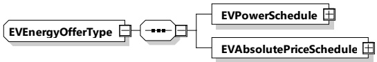
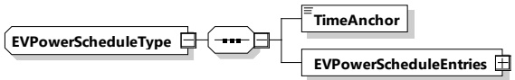

<table border=1 style='margin: auto; word-wrap: break-word;'><tr><td style='text-align: center; word-wrap: break-word;'>Element name</td><td style='text-align: center; word-wrap: break-word;'>Type</td><td style='text-align: center; word-wrap: break-word;'>Semantics</td></tr><tr><td style='text-align: center; word-wrap: break-word;'>PriceLevelSchedule</td><td style='text-align: center; word-wrap: break-word;'>complexType:PriceLevelScheduleTypePriceScheduleTyperefer to 8.3.5.3.62</td><td style='text-align: center; word-wrap: break-word;'>Optional:PriceLevel schedule for this session</td></tr></table>

[V2G20-2176] The SECC shall either provide an AbsolutePriceSchedule or a PriceLevelSchedule as part of the ChargingScheduleType.

###### 8.3.5.3.41 EVEnergyOfferType

The EVEnergyOffer extends the scheduled control mode by adding the possibility for EVCCs to offer energy (discharging capabilities) for a certain price per kWh to the infrastructure. This offer can be included by the SECC into the DischargingSchedule and be offered back to the EVCC again. The EVPowerSchedule describes the maximum flexibility to feedback energy regarding time and power, the energy amount is limited and defined by the absolute value of EVTargetEnergyRequest. A negative value indicates the willingness to discharge under specific conditions, a positive value indicates that the EV currently is not able to offer energy to discharge.

[V2G20-1881]

The SECC and the EVCC shall implement this type as defined in Figure 138 and Table 135.

Figure 138 — Schema diagram - EVEnergyOfferType

The elements of this message are used according to Table 135.

Table 135 — Semantics and type definition for EVEnergyOfferType

<table border=1 style='margin: auto; word-wrap: break-word;'><tr><td style='text-align: center; word-wrap: break-word;'>Element name</td><td style='text-align: center; word-wrap: break-word;'>Type</td><td style='text-align: center; word-wrap: break-word;'>Semantics</td></tr><tr><td style='text-align: center; word-wrap: break-word;'>EVPowerSchedule</td><td style='text-align: center; word-wrap: break-word;'>complexType:EVPowerScheduleTyperefer to 8.3.5.3.42</td><td style='text-align: center; word-wrap: break-word;'>Encapsulating element describing all relevant details for one EVPowerSchedule as defined by the EVCC. It is used to communicate the hard limit of discharging power.</td></tr><tr><td style='text-align: center; word-wrap: break-word;'>EVAbsolutePriceSchedule</td><td style='text-align: center; word-wrap: break-word;'>complexType:EVAbsolutePriceScheduleTyperefer to 8.3.5.3.45</td><td style='text-align: center; word-wrap: break-word;'>Optional:EVAbsolutePriceSchedule for this session. It is used to communicate the Price for which the EV offers to discharge its stored energy.</td></tr></table>

###### 8.3.5.3.42 EVPowerScheduleType

[V2G20-1882]

The SECC and the EVCC shall implement this type as defined in Figure 139 and Table 136.

