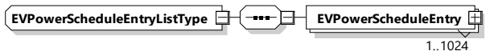
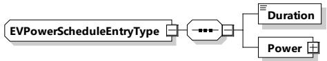

Figure 139 — Schema diagram - EVPowerScheduleType

The elements of this message are used according to Table 136.

Table 136 — Semantics and type definition for EVPowerScheduleType

<table border=1 style='margin: auto; word-wrap: break-word;'><tr><td style='text-align: center; word-wrap: break-word;'>Element name</td><td style='text-align: center; word-wrap: break-word;'>Type</td><td style='text-align: center; word-wrap: break-word;'>Semantics</td></tr><tr><td style='text-align: center; word-wrap: break-word;'>TimeAnchor</td><td style='text-align: center; word-wrap: break-word;'>simpleType:xs:unsignedLong</td><td style='text-align: center; word-wrap: break-word;'>The time that defines the starting point for the EVEnergyOffer.The value is encoded at microseconds resolution in SECC time, a concept that is defined in 8.3.3.3.</td></tr><tr><td style='text-align: center; word-wrap: break-word;'>EVPowerScheduleEntries</td><td style='text-align: center; word-wrap: break-word;'>complexType:EVPowerScheduleEntryListTyperefer to 8.3.5.3.43</td><td style='text-align: center; word-wrap: break-word;'>List of EVPowerScheduleEntry elements.The number of EVPowerScheduleEntry elements is limited by the parameter MaximumSupportingPoints (according to [V2G20-1056]).</td></tr></table>

[V2G20-2138] The TimeAnchor of an EVPowerScheduleType element shall define the point in time when the first EVPowerScheduleEntry element starts to be active.

###### 8.3.5.3.43 EVPowerScheduleEntryListType

[V2G20-1883] The SECC and the EVCC shall implement this type as defined in Figure 140 and Table 137.

Figure 140 — Schema diagram - EVPowerScheduleEntryListType

The elements of this message are used according to Table 137.

Table 137 — Semantics and type definition for EVPowerScheduleEntryListType

<table border=1 style='margin: auto; word-wrap: break-word;'><tr><td style='text-align: center; word-wrap: break-word;'>Element name</td><td style='text-align: center; word-wrap: break-word;'>Type</td><td style='text-align: center; word-wrap: break-word;'>Semantics</td></tr><tr><td style='text-align: center; word-wrap: break-word;'>EVPowerScheduleEntry</td><td style='text-align: center; word-wrap: break-word;'>complexType:EVPowerScheduleEntryTyperefer to 8.3.5.3.44</td><td style='text-align: center; word-wrap: break-word;'>List of EVPowerScheduleEntry elements.The number of EVPowerScheduleEntry elements is limited by the parameterMaximumSupportingPoints (according to [V2G20-1056]).</td></tr></table>

###### 8.3.5.3.44 EVPowerScheduleEntryType

[V2G20-1884] The SECC and the EVCC shall implement this type as defined in Figure 141 and Table 138.

Figure 141 — Schema diagram - EVPowerScheduleEntryType

The elements of this message are used according to Table 138.

## Table 138 — Semantics and type definition for EVPowerScheduleEntryType

Copied with the permission of ANSI on behalf of ISO in connection with USDOT National Electric Vehicle Infrastructure (NEVI) Formula Program. Copying not permitted. ©ISO. All rights reserved.