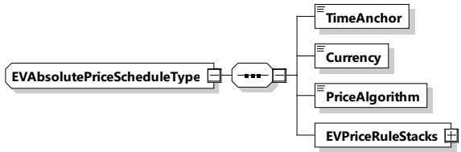

<table border=1 style='margin: auto; word-wrap: break-word;'><tr><td style='text-align: center; word-wrap: break-word;'>Element name</td><td style='text-align: center; word-wrap: break-word;'>Type</td><td style='text-align: center; word-wrap: break-word;'>Semantics</td></tr><tr><td rowspan="2">Duration</td><td style='text-align: center; word-wrap: break-word;'>simpleType:</td><td rowspan="2">Duration of the EVPowerScheduleEntries. The amount of seconds that define the duration of the given EVPowerScheduleEntries.</td></tr><tr><td style='text-align: center; word-wrap: break-word;'>xs:unsignedInt</td></tr><tr><td rowspan="3">Power</td><td style='text-align: center; word-wrap: break-word;'>complexType:</td><td rowspan="3">Defines maximum amount of power for the duration of this EVPowerScheduleEntry to be discharged from the EV battery through EVSE power outlet. Negative values are used for discharging.</td></tr><tr><td style='text-align: center; word-wrap: break-word;'>RationalNumberType</td></tr><tr><td style='text-align: center; word-wrap: break-word;'>refer to 8.3.5.3.8</td></tr></table>

NOTE The precise physical meaning of Power is related to the chosen charging technology. Refer to 8.3.5.3.8.

[V2G20-2139] The duration element shall define the active period of time (s) for the respective parent element of EVPowerScheduleEntryType.

[V2G20-2140] If AC was selected as energy transfer mode, the Power element shall define the maximum amount of apparent power to be drawn from the EV when the element of type EVPowerScheduleEntryType is active. The power can freely be drawn from any phase, but the real AC polyphase discharging behavior should always respect the maximum allowed asymmetry at the grid connection point as defined by the local grid code.

[V2G20-2141] The power elements in the EVPowerScheduleType shall always be smaller or equal to zero as they communicate the discharging capabilities of the EV.

###### 8.3.5.3.45 EVAbsolutePriceScheduleType

[V2G20-1885] The SECC and the EVCC shall implement this type as defined in Figure 142 and Table 139.

Figure 142 — Schema diagram - EVAbsolutePriceScheduleType

The elements of this message are used according to Table 139.

Table 139 — Semantics and type definition for EVAbsolutePriceScheduleType

<table border=1 style='margin: auto; word-wrap: break-word;'><tr><td style='text-align: center; word-wrap: break-word;'>Element name</td><td style='text-align: center; word-wrap: break-word;'>Type</td><td style='text-align: center; word-wrap: break-word;'>Semantics</td></tr><tr><td style='text-align: center; word-wrap: break-word;'>TimeAnchor</td><td style='text-align: center; word-wrap: break-word;'>complexType:xs:unsignedLong</td><td style='text-align: center; word-wrap: break-word;'>The time that defines the starting point for the EVEnergyOffer.The value is encoded at microseconds resolution in SECC time, a concept that is defined in 8.3.3.3</td></tr><tr><td style='text-align: center; word-wrap: break-word;'>Currency</td><td style='text-align: center; word-wrap: break-word;'>complexType:currencyTyperefer to Annex A for the type definition</td><td style='text-align: center; word-wrap: break-word;'>Currency for the pricing according to ISO 4217</td></tr></table>