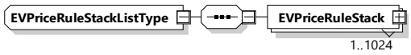

<table border=1 style='margin: auto; word-wrap: break-word;'><tr><td style='text-align: center; word-wrap: break-word;'>Element name</td><td style='text-align: center; word-wrap: break-word;'>Type</td><td style='text-align: center; word-wrap: break-word;'>Semantics</td></tr><tr><td style='text-align: center; word-wrap: break-word;'>PriceAlgorithm</td><td style='text-align: center; word-wrap: break-word;'>simpleType:identifierTyperefer to Annex A for the type definition</td><td style='text-align: center; word-wrap: break-word;'>A string in URN notation which shall uniquely identify an algorithm that defines how to compute an energy fee sum for a specific power profile based on the EnergyFee information from the EVPriceRule elements</td></tr><tr><td style='text-align: center; word-wrap: break-word;'>EVPriceRuleStacks</td><td style='text-align: center; word-wrap: break-word;'>complexType:EVPriceRuleStackListTypeRefer to 8.3.5.3.46</td><td style='text-align: center; word-wrap: break-word;'>A set of pricing rules for energy costs</td></tr></table>

[V2G20-2142] Only one currency shall be used for all EVAbsolutePriceSchedules.

NOTE 1 It is possible that the currency in EVAbsolutePriceSchedules can be different from the currency in AbsolutePriceSchedule.

NOTE 2 It is up to the SECC to decide on how to react to currencies that are unexpected.

[V2G20-2143] The number of EVPriceRules shall not exceed value of MaximumSupportingPoints.

NOTE 3 For requirements and informative text regarding PriceAlgorithm, please refer to 8.3.5.3.49.1 PriceAlgorithm identifiers.

###### 8.3.5.3.46 EVPriceRuleStackListType

[V2G20-1886] The SECC and the EVCC shall implement this type as defined in Figure 143 and Table 140.

Figure 143 — Schema diagram - EVPriceRuleStackListType

The elements of this message are used according to Table 140.

Table 140 — Semantics and type definition for EVPriceRuleStackListType

<table border=1 style='margin: auto; word-wrap: break-word;'><tr><td style='text-align: center; word-wrap: break-word;'>Element name</td><td style='text-align: center; word-wrap: break-word;'>Type</td><td style='text-align: center; word-wrap: break-word;'>Semantics</td></tr><tr><td style='text-align: center; word-wrap: break-word;'>EVPriceRuleStack</td><td style='text-align: center; word-wrap: break-word;'>complexType:EVPriceRuleStackTyperefer to 8.3.5.3.47</td><td style='text-align: center; word-wrap: break-word;'>Contains the EVPriceRules.</td></tr></table>

[V2G20-2144] An EVPriceRuleStack shall become active when the previous EVPriceRuleStack has expired, or when it is the first EVPriceRuleStack in the EVAbsolutePriceSchedule.

[V2G20-2145] An EVPriceRuleStack expires when the current time is greater than the starting time of the EVPriceRuleStack plus the Duration.

[V2G20-2146] The first EVPriceRule in the EVPriceRuleStack shall start at the same time as the parent EVAbsolutePriceScheduleType's TimeAnchor.

###### 8.3.5.3.47 EVPriceRuleStackType

[V2G20-2147] The SECC and the EVCC shall implement this type as defined in Figure 144 and Table 141.

Copied with the permission of ANSI on behalf of ISO in connection with USDOT National Electric Vehicle Infrastructure (NEVI) Formula Program. Copying not permitted. ©ISO. All rights reserved.