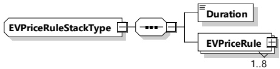
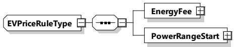

Figure 144 — Schema diagram - EVPriceRuleStackType

The elements of this message are used according to Table 141.

Table 141 — Semantics and type definition for EVPriceRuleStackType

<table border=1 style='margin: auto; word-wrap: break-word;'><tr><td style='text-align: center; word-wrap: break-word;'>Element name</td><td style='text-align: center; word-wrap: break-word;'>Type</td><td style='text-align: center; word-wrap: break-word;'>Semantics</td></tr><tr><td style='text-align: center; word-wrap: break-word;'>Duration</td><td style='text-align: center; word-wrap: break-word;'>simpleType:xs:unsignedInt</td><td style='text-align: center; word-wrap: break-word;'>Duration of the stack of price rules. The amount of seconds that define the duration of the given EVPriceRuleStack.</td></tr><tr><td style='text-align: center; word-wrap: break-word;'>EVPriceRule</td><td style='text-align: center; word-wrap: break-word;'>complexType:EVPriceRuleTyperefer to 8.3.5.3.48</td><td style='text-align: center; word-wrap: break-word;'>A set of pricing rules for energy costs.</td></tr></table>

[V2G20-2148] Overlapping (stacked) EVPriceRules shall all start at the same time.

NOTE EVPriceRulesStack allows for EVPriceRules with different PowerRangeStart values.

###### 8.3.5.3.48 EVPriceRuleType

[V2G20-2149] The SECC and the EVCC shall implement this type as defined in Figure 145 and Table 142.

Figure 145 — Schema diagram - EVPriceRuleType

The elements of this message are used according to Table 142.

Table 142 — Semantics and type definition for EVPriceRuleType

<table border=1 style='margin: auto; word-wrap: break-word;'><tr><td style='text-align: center; word-wrap: break-word;'>Element name</td><td style='text-align: center; word-wrap: break-word;'>Type</td><td style='text-align: center; word-wrap: break-word;'>Semantics</td></tr><tr><td rowspan="3">EnergyFee</td><td style='text-align: center; word-wrap: break-word;'>complexType:</td><td style='text-align: center; word-wrap: break-word;'>Cost per kWh</td></tr><tr><td style='text-align: center; word-wrap: break-word;'>RationalNumberType</td><td rowspan="2">NOTE If the energy is free, then this value is zero.</td></tr><tr><td style='text-align: center; word-wrap: break-word;'>refer to 8.3.5.3.8</td></tr><tr><td rowspan="2">PowerRangeStart</td><td style='text-align: center; word-wrap: break-word;'>complexType:</td><td rowspan="2">The EnergyFee applies between this value and the value of the PowerRangeStart of the subsequent EVPriceRule. If the power is below this value, the EnergyFee of the previous EVPriceRule applies.</td></tr><tr><td style='text-align: center; word-wrap: break-word;'>RationalNumberType refer to 8.3.5.3.8</td></tr></table>

[V2G20-2150] An EVPriceRule shall become active when the current power is at or below the PowerRangeStart value.

[V2G20-2152] At least one active EVPriceRule shall have a PowerRangeStart with a value of zero.

[V2G20-2153] PowerRangeStart shall be less than or equal to zero.