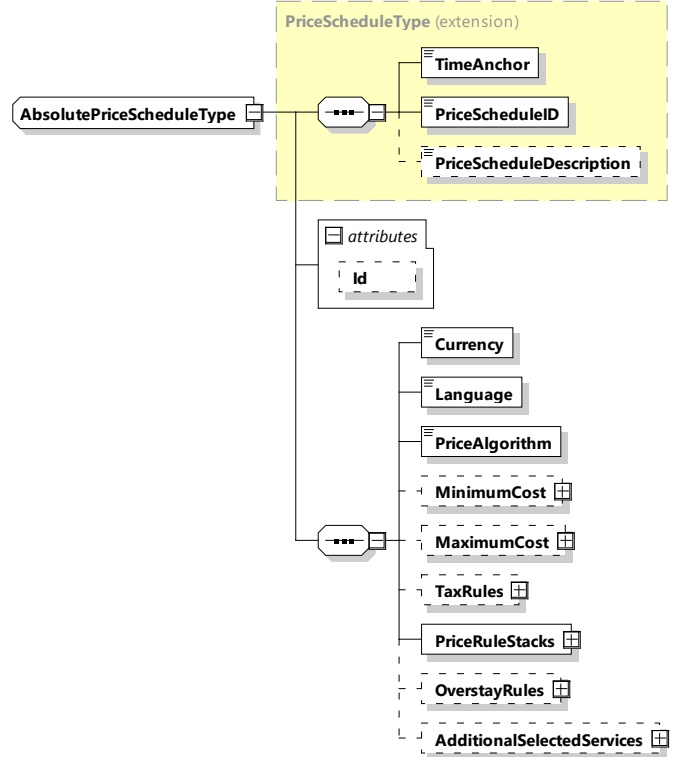

[V2G20-2154] PowerRangeStart values shall be unique within the same EVPriceRuleStack.

###### 8.3.5.3.49 AbsolutePriceScheduleType

This type represents the actual cost for a charging session. For examples showing the usage, please refer to Annex J.

NOTE IDs within AbsolutePrice are not used in this document, rather, they are provided for informational purposes (e.g. logging).

[V2G20-1887]

20-1887] The SECC and the EVCC shall implement this type as defined in Figure 146 and Table 143.

Figure 146 — Schema diagram - AbsolutePriceScheduleType

The elements of this message are used according to Table 143.

Table 143 — Semantics and type definition for AbsolutePriceScheduleType

<table border=1 style='margin: auto; word-wrap: break-word;'><tr><td style='text-align: center; word-wrap: break-word;'>Element name</td><td style='text-align: center; word-wrap: break-word;'>Type</td><td style='text-align: center; word-wrap: break-word;'>Semantics</td></tr><tr><td style='text-align: center; word-wrap: break-word;'>Id</td><td style='text-align: center; word-wrap: break-word;'>simpleType:xs:ID</td><td style='text-align: center; word-wrap: break-word;'>This element is used for referencing the remaining elements of this table in the message header when a signature needs to be applied.</td></tr></table>