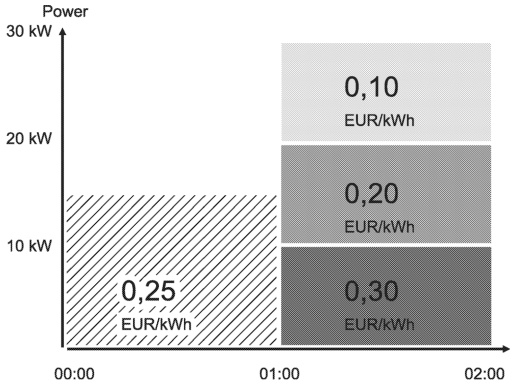
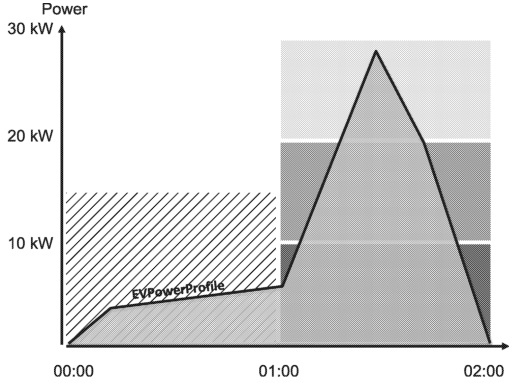
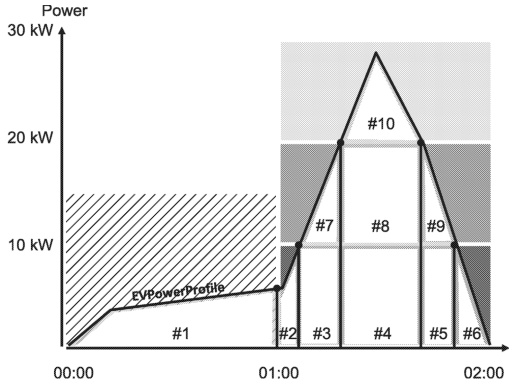

Figure 147 — Example for a set of PriceRule elements and their associated EnergyFee

Figure 148 — Example for boundaries of different PriceRules with an EVPowerProfile

Given a hypothetical EVPowerProfile (Figure 148) each intersection of its curve with the boundaries of the different PriceRules will result in an area that defines a particular energy content.

Figure 149 — Example with for the PriceAlgorithm with different PriceRules

