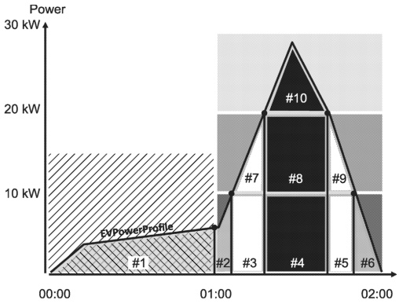
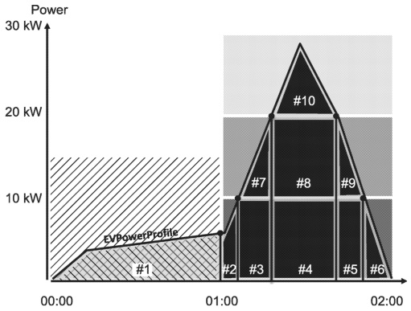

In this example (Figure 149), one will end up with 10 distinct areas. While those areas are always the same each, PriceAlgorithm will apply a different rule which determines the price (EnergyFee) that each of the 10 energy content areas need to be multiplied with in order to compute and predict a resulting energy fee sum.

Figure 150, Figure 151 and Figure 152 below show how the three PriceAlgorithm options would be applied. Figure 150 shows "1-Power", Figure 151 shows "2-PeakPower" and Figure 152 shows the "3-StackedEnergy" PriceAlgorithm. The energy content of each of the 10 areas is multiplied with the EnergyFee of the PriceRule with the corresponding color and then a sum is computed.

Figure 150 — Applying the PriceAlgorithm for 1-Power

[V2G20-1894]

The PriceAlgorithm identifier "urn:iso:std:iso:15118:-20:PriceAlgorithm:1-Power" shall identify an algorithm that follows the principles illustrated in Figure 150. For every given point in time the EnergyFee shall be applied which is defined in the PriceRule for the present power which is applied by the chosen charging technology.

Figure 151 — Applying the PriceAlgorithm for 2-PeakPower

[V2G20-1895]

The PriceAlgorithm identifier "urn:iso:std:iso:15118:-20:PriceAlgorithm:2-PeakPower" shall identify an algorithm that follows the principles illustrated in Figure 151. For every time span with one or multiple stacked PriceRules, all energy within that time span shall be priced according to the EnergyFee defined in the PriceRule that matches the highest peak power applied by the chosen charging technology during that time span.

