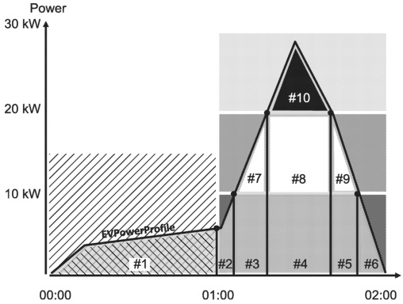
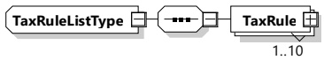

Figure 152 — Applying the PriceAlgorithm for 3-StackedEnergy

[V2G20-1896]

The PriceAlgorithm identifier "urn:iso:std:iso:15118:-20:PriceAlgorithm:3StackedEnergy" shall identify an algorithm that follows the principles illustrated in Figure 152. Energy shall be priced based on the EnergyFee defined in the PriceRules to the individual power bands and the amount of energy that was transferred within each corresponding power band.

NOTE 1 During the actual charging loop the present power level which is relevant for the PriceAlgorithm can be observed by the EVCC in different ways. For AC charging it is provided by the SECC via the EVSEPresentActivePower element. For DC charging it needs be computed based on the EVSEPresentVoltage and EVSEPresentCurrent elements.

NOTE 2 The use of unique URN based identifiers for the PriceAlgorithm allows an interoperable and well defined support of future proprietary use cases like fleet applications or special algorithms which can possibly be mandated by individual national regulation.

###### 8.3.5.3.50 TaxRuleListType

This type represents the list of tax rules to be applied to a charging session.

[V2G20-1894] The SECC and the EVCC shall implement this type as defined in Figure 153 and Table 144.

Figure 153 — Schema diagram - TaxRuleListType

The elements of this message are used according to Table 144.

Table 144 — Semantics and type definition for TaxRuleListType

<table border=1 style='margin: auto; word-wrap: break-word;'><tr><td style='text-align: center; word-wrap: break-word;'>Element name</td><td style='text-align: center; word-wrap: break-word;'>Type</td><td style='text-align: center; word-wrap: break-word;'>Semantics</td></tr><tr><td style='text-align: center; word-wrap: break-word;'>TaxRule</td><td style='text-align: center; word-wrap: break-word;'>complexType:TaxRuleTyperefer to 8.3.5.3.51</td><td style='text-align: center; word-wrap: break-word;'>Individual entry of a list of tax rules</td></tr></table>

###### 8.3.5.3.51 TaxRuleType