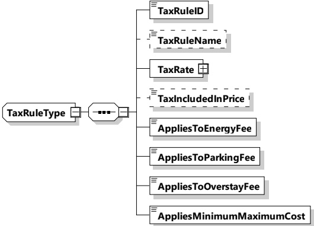

This type represents the tax rule to be applied to a charging session.

[V2G20-1898]

The SECC and the EVCC shall implement this type as defined in Figure 154 and Table 145.

Figure 154 — Schema diagram - TaxRuleType

The elements of this message are used according to Table 145.

Table 145 — Semantics and type definition for TaxRuleType

<table border=1 style='margin: auto; word-wrap: break-word;'><tr><td style='text-align: center; word-wrap: break-word;'>Element name</td><td style='text-align: center; word-wrap: break-word;'>Type</td><td style='text-align: center; word-wrap: break-word;'>Semantics</td></tr><tr><td style='text-align: center; word-wrap: break-word;'>TaxRuleID</td><td style='text-align: center; word-wrap: break-word;'>simpleType:numericIDTyperefer to Annex A for the type definition</td><td style='text-align: center; word-wrap: break-word;'>Identifier for the tax rule.</td></tr><tr><td style='text-align: center; word-wrap: break-word;'>TaxRuleName</td><td style='text-align: center; word-wrap: break-word;'>simpleType:nameTyperefer to Annex A for the type definition</td><td style='text-align: center; word-wrap: break-word;'>Optional:Human readable string to identify the tax rule.</td></tr><tr><td style='text-align: center; word-wrap: break-word;'>TaxRate</td><td style='text-align: center; word-wrap: break-word;'>complexType:RationalNumberTypeRefer to 8.3.5.3.8</td><td style='text-align: center; word-wrap: break-word;'>Percentage of the total amount of applying fee (energy, parking, overstay, MinimumCost and/or MaximumCost)</td></tr><tr><td style='text-align: center; word-wrap: break-word;'>TaxIncludedInPrice</td><td style='text-align: center; word-wrap: break-word;'>simpleType:xs:boolean</td><td style='text-align: center; word-wrap: break-word;'>Optional:Indicates whether the tax is included in any price or not.</td></tr><tr><td style='text-align: center; word-wrap: break-word;'>AppliesToEnergyFee</td><td style='text-align: center; word-wrap: break-word;'>simpleType:xs:boolean</td><td style='text-align: center; word-wrap: break-word;'>Indicates whether this tax applies to Energy Fees.</td></tr><tr><td style='text-align: center; word-wrap: break-word;'>AppliesToParkingFee</td><td style='text-align: center; word-wrap: break-word;'>simpleType:xs:boolean</td><td style='text-align: center; word-wrap: break-word;'>Indicates whether this tax applies to Parking Fees.</td></tr><tr><td style='text-align: center; word-wrap: break-word;'>AppliesToOverstayFee</td><td style='text-align: center; word-wrap: break-word;'>simpleType:xs:boolean</td><td style='text-align: center; word-wrap: break-word;'>Indicates whether this tax applies to Overstay Fees.</td></tr></table>