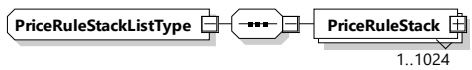
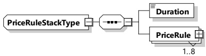

<table border=1 style='margin: auto; word-wrap: break-word;'><tr><td style='text-align: center; word-wrap: break-word;'>Element name</td><td style='text-align: center; word-wrap: break-word;'>Type</td><td style='text-align: center; word-wrap: break-word;'>Semantics</td></tr><tr><td style='text-align: center; word-wrap: break-word;'>AppliesToMinimumMaximumCost</td><td style='text-align: center; word-wrap: break-word;'>simpleType:xs:boolean</td><td style='text-align: center; word-wrap: break-word;'>Indicates whether this tax applies to MinimumCost and/or MaximumCost.</td></tr></table>

[V2G20-1899] Each TaxRuleID shall be unique in AbsolutePrice.

###### 8.3.5.3.52 PriceRuleStackListType

This type contains all of the pricing rules that will apply to a charging session.

[V2G20-2155] The SECC and the EVCC shall implement this type as defined in Figure 155 and Table 146.

Figure 155 — Schema diagram - PriceRuleStackListType

The elements of this message are used according to Table 146.

Table 146 — Semantics and type definition for PriceRuleStackListType

<table border=1 style='margin: auto; word-wrap: break-word;'><tr><td style='text-align: center; word-wrap: break-word;'>Element name</td><td style='text-align: center; word-wrap: break-word;'>Type</td><td style='text-align: center; word-wrap: break-word;'>Semantics</td></tr><tr><td style='text-align: center; word-wrap: break-word;'>PriceRuleStack</td><td style='text-align: center; word-wrap: break-word;'>complexType:PriceRuleStackTypeRefer to 8.3.5.3.53</td><td style='text-align: center; word-wrap: break-word;'>Contains the PriceRules.The number of PriceRuleStack elements is limited by the parameterMaximumSupportingPoints (according to [V2G20-1056]).</td></tr></table>

###### 8.3.5.3.53 PriceRuleStackType

This type represents the collection of pricing rules that will apply to a charging session. This element defines how long the various price rules will be active.

[V2G20-1900]

The SECC and the EVCC shall implement this type as defined in Figure 156 and Table 147.

Figure 156 — Schema diagram - PriceRuleStackType

The elements of this message are used according to Table 147.