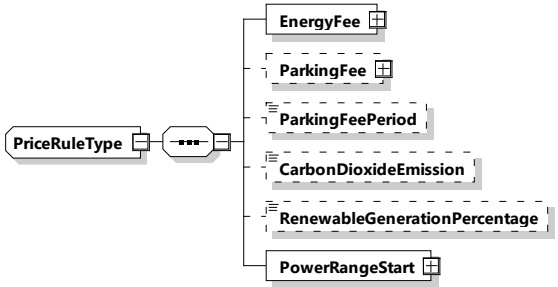

Table 147 — Semantics and type definition for PriceRuleStackType

<table border=1 style='margin: auto; word-wrap: break-word;'><tr><td style='text-align: center; word-wrap: break-word;'>Element name</td><td style='text-align: center; word-wrap: break-word;'>Type</td><td style='text-align: center; word-wrap: break-word;'>Semantics</td></tr><tr><td style='text-align: center; word-wrap: break-word;'>Duration</td><td style='text-align: center; word-wrap: break-word;'>simpleType:xs:unsignedInt</td><td style='text-align: center; word-wrap: break-word;'>Duration of the stack of price rulesThe amount of seconds that define the duration of the given PriceRule(s).Note that this allows for roughly 17,8 h per PriceRuleStack.</td></tr><tr><td style='text-align: center; word-wrap: break-word;'>PriceRule</td><td style='text-align: center; word-wrap: break-word;'>complexType:PriceRuleTypeRefer to 8.3.5.3.54</td><td style='text-align: center; word-wrap: break-word;'>Contains the PriceRule(s).</td></tr></table>

[V2G20-1901] All PriceRule elements in PriceRuleStackType shall all start at the same time.

NOTE 1 PriceRuleStack allows for PriceRule elements with different PowerRangeStart values.

[V2G20-1902] A PriceRuleStack shall become active when the previous PriceRuleStack has expired, or when it is the first PriceRuleStack in the AbsolutePriceSchedule.

[V2G20-1903] A PriceRuleStack expires when the current time is greater than the starting time of the PriceRuleStack plus the Duration.

[V2G20-1904] The first PriceRuleStack shall start at the same time as the parent AbsolutePriceScheduleType's TimeAnchor.

NOTE 2 There can be more than one PriceRule in a PriceRuleStack, in which case those PriceRule elements are stacked.

NOTE 3 If the PriceRuleStack is not intended to be stacked, then there will only be one PriceRule in that PriceRuleStack.

###### 8.3.5.3.54 PriceRuleType

[V2G20-1764] The SECC and the EVCC shall implement this type as defined in Figure 157 and Table 148.

Figure 157 — Schema diagram - PriceRuleType

The elements of this message are used according to Table 148.