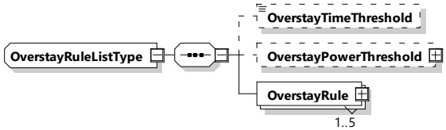

###### 8.3.5.3.55 OverstayRuleListType

This type represents rules used to discourage EVs from staying too long at an EVSE. The typical scenario would be an EV finishes charging, but the driver does not return to move the car for several hours causing other people to not be able to charge.

The overstay would become active by either a time trigger (OverstayTimeThreshold) or a power level trigger (OverstayPowerThreshold). Once either of those triggers become active, then the OverstayRule becomes active. The price of the overstay is defined in list of OverstayRules.

Once the overstay is triggered, the OverstayRules become active when the time from triggering is greater than their StartTime.

[V2G20-1909]

The SECC and the EVCC shall implement this type as defined in Figure 158 and Table 149.

Figure 158 — Schema diagram - OverstayRuleListType

The elements of this message are used according to Table 149.

Table 149 — Semantics and type definition for OverstayRuleListType

<table border=1 style='margin: auto; word-wrap: break-word;'><tr><td style='text-align: center; word-wrap: break-word;'>Element name</td><td style='text-align: center; word-wrap: break-word;'>Type</td><td style='text-align: center; word-wrap: break-word;'>Semantics</td></tr><tr><td style='text-align: center; word-wrap: break-word;'>OverstayTimeThreshold</td><td style='text-align: center; word-wrap: break-word;'>simpleTypexs:unsignedInt</td><td style='text-align: center; word-wrap: break-word;'>Optional:Time till overstay is applied.</td></tr><tr><td style='text-align: center; word-wrap: break-word;'>OverstayPowerThreshold</td><td style='text-align: center; word-wrap: break-word;'>complexType:RationalNumberTypeRefer to 8.3.5.3.8</td><td style='text-align: center; word-wrap: break-word;'>Optional:Power threshold at which the overstay applies.</td></tr><tr><td style='text-align: center; word-wrap: break-word;'>OverstayRule</td><td style='text-align: center; word-wrap: break-word;'>complexType:OverstayRuleTypeRefer to 8.3.5.3.56</td><td style='text-align: center; word-wrap: break-word;'>Overstay rules that will be applied.</td></tr></table>

[V2G20-1910] There shall be only one overstay active at any time.

[V2G20-1911] The OverstayRule(s) shall become active when the time matches the OverstayTimeThreshold + the time when the OverstayRuleList became active or when the power being transferred is less than OverstayPowerThreshold.

[V2G20-1912] When a new overstay becomes active, the overstay that was previously active shall become inactive.

[V2G20-1913] Each OverstayListID shall be unique.

NOTE 1 Overstay rules are active in parallel to PriceRules.

[V2G20-2159] Once the overstay is triggered (e.g. by low power levels or timer), then the overstay remains triggered until replaced by another overstay.