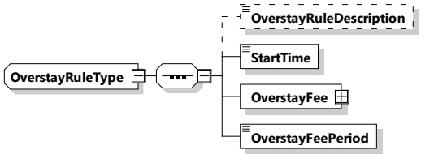
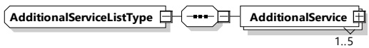

If OverstayPowerThreshold is set, and the power level has risen above the value, then the overstay will trigger if the power drops below this threshold.

NOTE 2 This is to prevent the overstay being triggered prior to actual power transfer.

###### 8.3.5.3.56 Overstay Rule Type

This type represents individual rules that add up to an overall overstay charge. Each of these OverstayRule elements apply relative to when the parent OverstayRules was triggered.

[V2G20-1914]

The SECC and the EVCC shall implement this type as defined in Figure 159 and Table 150.

Figure 159 — Schema diagram - OverstayRuleType

The elements of this message are used according to Table 150.

Table 150 — Semantics and type definition for OverstayRuleType

<table border=1 style='margin: auto; word-wrap: break-word;'><tr><td style='text-align: center; word-wrap: break-word;'>Element name</td><td style='text-align: center; word-wrap: break-word;'>Type</td><td style='text-align: center; word-wrap: break-word;'>Semantics</td></tr><tr><td style='text-align: center; word-wrap: break-word;'>OverstayRuleDescription</td><td style='text-align: center; word-wrap: break-word;'>simpleType:descriptionTyperefer to Annex A for the type definition</td><td style='text-align: center; word-wrap: break-word;'>Optional:Human readable string to identify the overstay rule.</td></tr><tr><td style='text-align: center; word-wrap: break-word;'>StartTime</td><td style='text-align: center; word-wrap: break-word;'>simpleType:xs:unsignedInt</td><td style='text-align: center; word-wrap: break-word;'>Time in seconds after trigger of the parent OverstayRules for this particular fee to apply</td></tr><tr><td style='text-align: center; word-wrap: break-word;'>OverstayFee</td><td style='text-align: center; word-wrap: break-word;'>complexType:RationalNumberTypeRefer to 8.3.5.3.8</td><td style='text-align: center; word-wrap: break-word;'>Fee that applies with this overstay</td></tr><tr><td style='text-align: center; word-wrap: break-word;'>OverstayFeePeriod</td><td style='text-align: center; word-wrap: break-word;'>simpleType:xs:unsignedInt</td><td style='text-align: center; word-wrap: break-word;'>Time till overstay will be reapplied</td></tr></table>

[V2G20-2161] Each OverstayID shall be unique.

###### 8.3.5.3.57 AdditionalServiceListType

This type represents the list of additional services.

[V2G20-1915]

The SECC and the EVCC shall implement this type as defined in Figure 160 and Table 151.

Figure 160 — Schema diagram - AdditionalServiceListType

