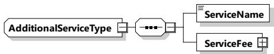

The elements of this message are used according to Table 151.

Table 151 — Semantics and type definition for AdditionalServiceListType

<table border=1 style='margin: auto; word-wrap: break-word;'><tr><td style='text-align: center; word-wrap: break-word;'>Element name</td><td style='text-align: center; word-wrap: break-word;'>Type</td><td style='text-align: center; word-wrap: break-word;'>Semantics</td></tr><tr><td style='text-align: center; word-wrap: break-word;'>AdditionalSelectedServices</td><td style='text-align: center; word-wrap: break-word;'>complexType:AdditionalServicesTypeRefer to 8.3.5.3.58</td><td style='text-align: center; word-wrap: break-word;'>A set of price rules for optional services (e.g. valet, carwash)</td></tr></table>

###### 8.3.5.3.58 Additional Service Type

This type represents rules used to describe any additional services that have already been selected, such as valet or carwash.

[V2G20-1925]

The SECC and the EVCC shall implement this type as defined in Figure 161 and Table 152.

Figure 161 — Schema diagram - Additional Service Type

The elements of this message are used according to Table 152.

Table 152 — Semantics and type definition for AdditionalServiceType

<table border=1 style='margin: auto; word-wrap: break-word;'><tr><td style='text-align: center; word-wrap: break-word;'>Element name</td><td style='text-align: center; word-wrap: break-word;'>Type</td><td style='text-align: center; word-wrap: break-word;'>Semantics</td></tr><tr><td style='text-align: center; word-wrap: break-word;'>ServiceName</td><td style='text-align: center; word-wrap: break-word;'>simpleType:nameTyperefer to Annex A for the type definition</td><td style='text-align: center; word-wrap: break-word;'>Human readable string to identify the service</td></tr><tr><td style='text-align: center; word-wrap: break-word;'>ServiceFee</td><td style='text-align: center; word-wrap: break-word;'>complexType:RationalNumberTypeRefer to 8.3.5.3.8</td><td style='text-align: center; word-wrap: break-word;'>Cost of the service</td></tr></table>

[V2G20-1916] Each ServiceName shall be unique.

###### 8.3.5.3.59 ReceiptType

This type details a transaction in the session, providing a time anchor, and information on energy costs, occupancy costs, overstay costs, taxes, and any additional services.

[V2G20-1917]

The SECC and the EVCC shall implement this type as defined in Figure 162 and Table 153.

