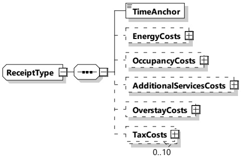

Figure 162 — Schema diagram — ReceiptType

The elements of this message are used according to Table 153.

Table 153 — Semantics and type definition for ReceiptType

<table border=1 style='margin: auto; word-wrap: break-word;'><tr><td style='text-align: center; word-wrap: break-word;'>Element name</td><td style='text-align: center; word-wrap: break-word;'>Type</td><td style='text-align: center; word-wrap: break-word;'>Semantics</td></tr><tr><td style='text-align: center; word-wrap: break-word;'>TimeAnchor</td><td style='text-align: center; word-wrap: break-word;'>simpleType:xs-unsignedLong</td><td style='text-align: center; word-wrap: break-word;'>The time at which the receipt was issued. The value is encoded at microseconds resolution in SECC time, a concept that is defined in 8.3.3.3.</td></tr><tr><td style='text-align: center; word-wrap: break-word;'>EnergyCosts</td><td style='text-align: center; word-wrap: break-word;'>complexType:DetailedCostTyperefer to Annex A for the type definition</td><td style='text-align: center; word-wrap: break-word;'>Optional:Energy cost - reported in amount (kWh) and costPerUnit (current per kWh).</td></tr><tr><td style='text-align: center; word-wrap: break-word;'>OccupancyCosts</td><td style='text-align: center; word-wrap: break-word;'>complexType:DetailedCostTyperefer to Annex A for the type definition</td><td style='text-align: center; word-wrap: break-word;'>Optional:Occupancy cost - reported in amount (duration) and costPerUnit (cost per duration).</td></tr><tr><td style='text-align: center; word-wrap: break-word;'>AdditionalServicesCosts</td><td style='text-align: center; word-wrap: break-word;'>complexType:DetailedCostTyperefer to Annex A for the type definition</td><td style='text-align: center; word-wrap: break-word;'>Optional:Cost of additional services - name of service, and cost of the service</td></tr><tr><td style='text-align: center; word-wrap: break-word;'>OverstayCosts</td><td style='text-align: center; word-wrap: break-word;'>complexType:DetailedCostTyperefer to Annex A for the type definition</td><td style='text-align: center; word-wrap: break-word;'>Optional:Overstay cost - reported in amount (duration) and costPerUnit (current per duration).</td></tr><tr><td style='text-align: center; word-wrap: break-word;'>TaxCosts</td><td style='text-align: center; word-wrap: break-word;'>complexType:DetailedTaxTyperefer to 8.3.5.3.60</td><td style='text-align: center; word-wrap: break-word;'>Optional:Tax cost - name of tax rule and cost of the tax</td></tr></table>

[V2G20-1918] There shall be at least one cost per ReceiptType.

[V2G20-1919] If the receipt is based on kWh measurements, then the associated MeterInfo shall be sent as well.

###### 8.3.5.3.60 Detailed Tax Type