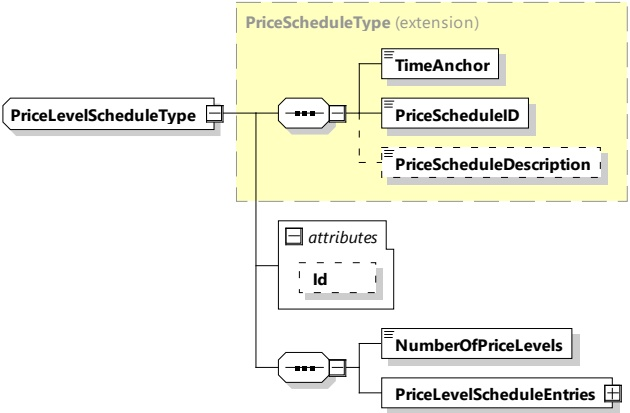

Figure 165 — Schema diagram — PriceLevelScheduleType

The elements of this message are used according to Table 156.

Table 156 — Semantics and type definition for PriceLevelScheduleType

<table border=1 style='margin: auto; word-wrap: break-word;'><tr><td style='text-align: center; word-wrap: break-word;'>Element name</td><td style='text-align: center; word-wrap: break-word;'>Type</td><td style='text-align: center; word-wrap: break-word;'>Semantics</td></tr><tr><td style='text-align: center; word-wrap: break-word;'>Id</td><td style='text-align: center; word-wrap: break-word;'>simpleType: xs:ID</td><td style='text-align: center; word-wrap: break-word;'>This element is used for referencing this type in the message header when a signature needs to be applied.</td></tr><tr><td style='text-align: center; word-wrap: break-word;'>TimeAnchor</td><td style='text-align: center; word-wrap: break-word;'>simpleType: xs:unsignedLong</td><td style='text-align: center; word-wrap: break-word;'>The time that defines the starting point for the PriceLevelSchedule. The value is encoded at microseconds resolution in SECC time, a concept that is defined in 8.3.3.3. In context of price level the TimeAnchor will define a time that either is the present or some point in the near past.</td></tr><tr><td style='text-align: center; word-wrap: break-word;'>PriceScheduleID</td><td style='text-align: center; word-wrap: break-word;'>simpleType: numericIDType refer to Annex A for the type definition</td><td style='text-align: center; word-wrap: break-word;'>Unique ID for the price schedule</td></tr><tr><td style='text-align: center; word-wrap: break-word;'>PriceScheduleDescription</td><td style='text-align: center; word-wrap: break-word;'>simpleType: descriptionType refer to Annex A for the type definition</td><td style='text-align: center; word-wrap: break-word;'>Optional: Optional description of the PriceSchedule.</td></tr><tr><td style='text-align: center; word-wrap: break-word;'>NumberOfPriceLevels</td><td style='text-align: center; word-wrap: break-word;'>simpleType: xs:unsignedByte</td><td style='text-align: center; word-wrap: break-word;'>Defines the overall number of distinct PriceLevel elements used across all PriceLevelSchedules.</td></tr><tr><td style='text-align: center; word-wrap: break-word;'>PriceLevelScheduleEntries</td><td style='text-align: center; word-wrap: break-word;'>complexType: PriceLevelScheduleEntryListType Refer 8.3.5.3.63</td><td style='text-align: center; word-wrap: break-word;'>List of entries of the PriceLevelSchedule</td></tr></table>