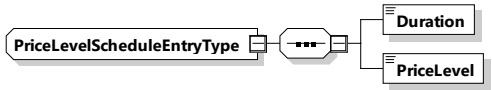

Table 157 — Semantics and type definition for PriceLevelScheduleEntryListType

<table border=1 style='margin: auto; word-wrap: break-word;'><tr><td style='text-align: center; word-wrap: break-word;'>Element name</td><td style='text-align: center; word-wrap: break-word;'>Type</td><td style='text-align: center; word-wrap: break-word;'>Semantics</td></tr><tr><td style='text-align: center; word-wrap: break-word;'>PriceLevelScheduleEntry</td><td style='text-align: center; word-wrap: break-word;'>complexType:PriceLevelScheduleEntryTyperefer to 8.3.5.3.64</td><td style='text-align: center; word-wrap: break-word;'>Encapsulating element describing all relevant details for one price level entry.The number of PowerScheduleEntry elements is limited by the parameter MaximumSupportingPoints (according to [V2G20-1056]).</td></tr></table>

[V2G20-2169] The valid range for the value of the PriceLevelScheduleEntry element shall be defined as being between zero and the value of NumberOfPriceLevels element, including the boundary values.

###### 8.3.5.3.64 PriceLevelScheduleEntryType

[V2G20-1924] The SECC and the EVCC shall implement this type as defined in Figure 167 and Table 158.

Figure 167 — Schema diagram — PriceLevelScheduleEntryType

The elements of this message are used according to Table 158.

Table 158 — Semantics and type definition for PriceLevelScheduleEntryType

<table border=1 style='margin: auto; word-wrap: break-word;'><tr><td style='text-align: center; word-wrap: break-word;'>Element name</td><td style='text-align: center; word-wrap: break-word;'>Type</td><td style='text-align: center; word-wrap: break-word;'>Semantics</td></tr><tr><td style='text-align: center; word-wrap: break-word;'>Duration</td><td style='text-align: center; word-wrap: break-word;'>simpleType:xs:unsignedInt</td><td style='text-align: center; word-wrap: break-word;'>The amount of seconds that define the duration of the given PriceLevelScheduleEntry.</td></tr><tr><td style='text-align: center; word-wrap: break-word;'>PriceLevel</td><td style='text-align: center; word-wrap: break-word;'>simpleType:xs:unsignedByte</td><td style='text-align: center; word-wrap: break-word;'>Defines the price level of this PriceLevelScheduleEntry (referring to NumberOfPriceLevels). Small values for the PriceLevel represent a cheaper PriceLevelScheduleEntry. Large values for the PriceLevel represent a more expensive PriceLevelScheduleEntry.</td></tr></table>

[V2G20-2170] The value of PriceLevel element shall indicate which price level is used for the duration of this PriceLevelScheduleEntry.

NOTE 1 The PriceLevel element is provided to enable the EVCC to calculate a price optimized charging profile in addition to the power limits.

NOTE 2 During the actual charging loop the present power level which is relevant for the PriceLevel can be observed by the EVCC in different ways. For AC charging it is provided by the SECC via the element EVSEPresentActivePower. For DC charging it is computed based on the EVSEPresentVoltage and EVSEPresentCurrent elements.

G20-2171] The PriceLevel shall adhere to the following rule: The smaller the value for PriceLevel the cheaper is the actual energy price level for the respective duration. The higher the value for PriceLevel, the more expensive is the actual energy price level for the respective duration.