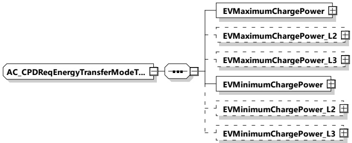

NOTE 3 The value of PriceLevel element only defines which price level is valid for the duration of the PriceLevelScheduleEntry in the PriceLevelSchedule. The value of the PriceLevel element does not indicate the actual costs (for charging), or actual refund (for discharging) within the timeframe for which the price level is valid.

[V2G20-2172] The TimeAnchor of a PriceLevelScheduleType element shall define the point in time when the first PriceLevelScheduleEntry element starts to be active.

[V2G20-2173] The Duration element shall define the active period of time (in seconds) for the respective parent element of PriceLevelScheduleEntryType.

NOTE 4 In a list of consecutive elements the start time of the first PriceLevelScheduleEntryType element is defined by the TimeAnchor of the parent element PriceLevelScheduleType.

[V2G20-2174] The start time of each element in a list of consecutive PriceLevelScheduleEntryType elements shall be defined as the point in time when the previous element becomes inactive (see [V2G20-2173])

NOTE 5 The start time of an element is defined by the expiration of the duration of the previous element in the list of consecutive PriceLevelScheduleEntryType elements.

Before the start time of the first element and after the last element in a list of elements of type PriceLevelScheduleEntryType becomes inactive the PriceLevel is not defined. In such case it is recommended to use the schedule renegotiation mechanism in order to receive valid price level information via a new PricelevelSchedule.

##### 8.3.5.4 AC

###### 8.3.5.4.1 AC_CPDReqEnergyTransferModeType

[V2G20-1344] The EVCC and the SECC shall implement this type as defined in Table 159 and Figure 168.

Figure 168 — Schema diagram - AC_CPDReqEnergyTransferModeType

The elements of this message are used according to Table 159.

Table 159 — Semantics and type definition for AC_CPDReqEnergyTransferModeType

<table border=1 style='margin: auto; word-wrap: break-word;'><tr><td style='text-align: center; word-wrap: break-word;'>Element name</td><td style='text-align: center; word-wrap: break-word;'>Type</td><td style='text-align: center; word-wrap: break-word;'>Semantics</td></tr><tr><td style='text-align: center; word-wrap: break-word;'>EVMaximumChargePower</td><td style='text-align: center; word-wrap: break-word;'>complexType:RationalNumberTyperefer to 8.3.5.3.8</td><td style='text-align: center; word-wrap: break-word;'>Maximum power supported by the EV</td></tr></table>