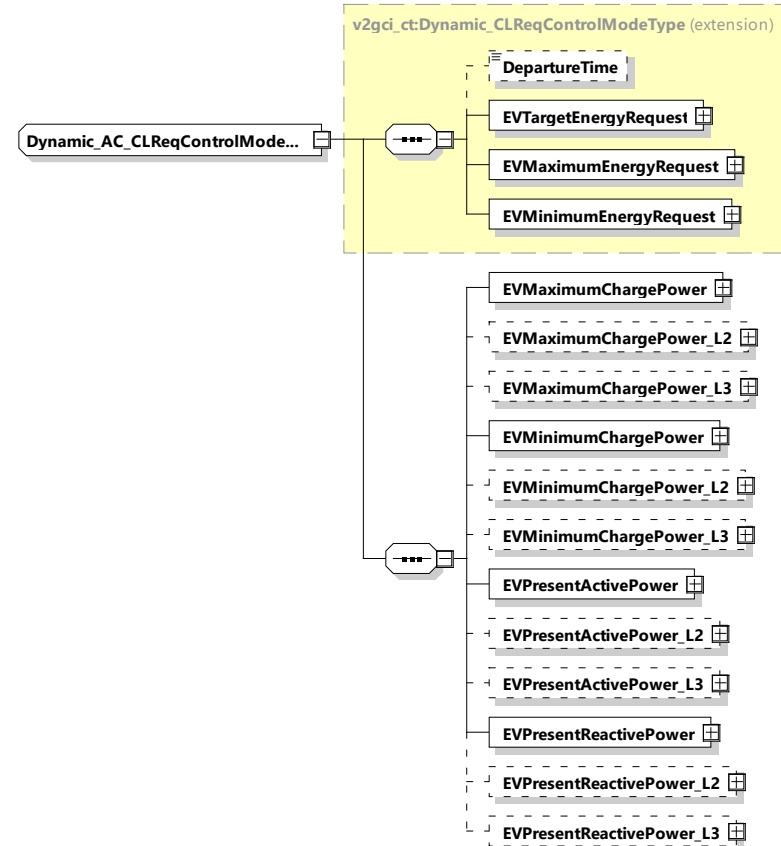

Figure 170 — Schema diagram - Dynamic_AC_CLReqControlModeType The elements of this message are used according to Table 161.

Table 161 — Semantics and type definition for Dynamic_AC_CLReqControlModeType

<table border=1 style='margin: auto; word-wrap: break-word;'><tr><td style='text-align: center; word-wrap: break-word;'>Element name</td><td style='text-align: center; word-wrap: break-word;'>Type</td><td style='text-align: center; word-wrap: break-word;'>Semantics</td></tr><tr><td style='text-align: center; word-wrap: break-word;'>DepartureTime</td><td style='text-align: center; word-wrap: break-word;'>simpleType:xs:unsignedInt</td><td style='text-align: center; word-wrap: break-word;'>Optional:DepartureTime given to the EVCC by the user, will overwrite the last given DepartureTime.This element is used to indicate when the EV intends to finish the energy transfer process.The value is encoded in seconds since the TimeStamp of the message header (see [V2G20-2104]).</td></tr><tr><td style='text-align: center; word-wrap: break-word;'>EVTargetEnergyRequest</td><td style='text-align: center; word-wrap: break-word;'>complexType:RationalNumberTyperefer to 8.3.5.3.8</td><td style='text-align: center; word-wrap: break-word;'>The energy request of the EV it needs to fulfil the target SOC as specified by the owner.</td></tr></table>