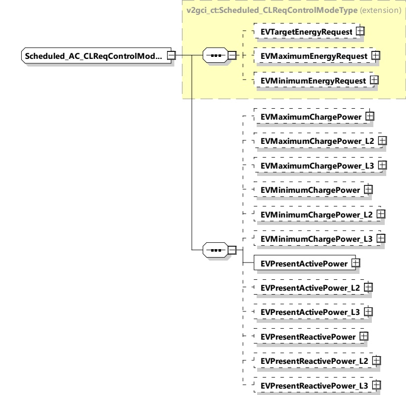

<table border=1 style='margin: auto; word-wrap: break-word;'><tr><td style='text-align: center; word-wrap: break-word;'>Element name</td><td style='text-align: center; word-wrap: break-word;'>Type</td><td style='text-align: center; word-wrap: break-word;'>Semantics</td></tr><tr><td rowspan="3">EVPresentReactivePower_L3</td><td style='text-align: center; word-wrap: break-word;'>complexType:</td><td style='text-align: center; word-wrap: break-word;'>Optional:</td></tr><tr><td style='text-align: center; word-wrap: break-word;'>RationalNumberType</td><td rowspan="2">Present reactive power achieved by the EV on phase L3 (as defined in 8.3.5.2.2)</td></tr><tr><td style='text-align: center; word-wrap: break-word;'>refer to 8.3.5.3.8</td></tr></table>

###### 8.3.5.4.4 Scheduled_AC_CLReqControlModeType

This type contains all elements of the AC_ChargeLoopReq message that are only required in case the control mode Scheduled is chosen.

[V2G20-1757]

The SECC and the EVCC shall implement this type as defined in Table 162 and Figure 171.

Figure 171 — Schema diagram - Scheduled_AC_CLReqControlModeType

The elements of this message are used according to Table 162.