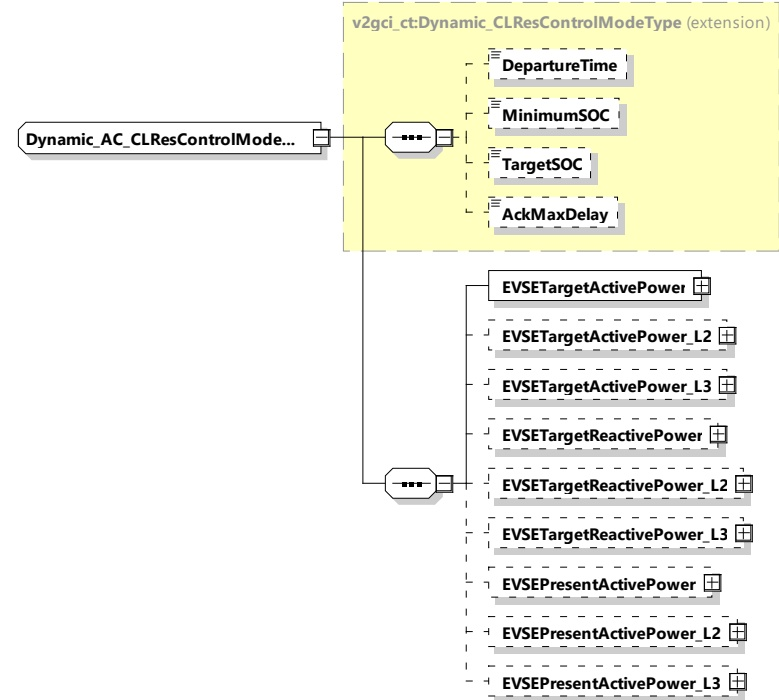

<table border=1 style='margin: auto; word-wrap: break-word;'><tr><td style='text-align: center; word-wrap: break-word;'>Element name</td><td style='text-align: center; word-wrap: break-word;'>Type</td><td style='text-align: center; word-wrap: break-word;'>Semantics</td></tr><tr><td style='text-align: center; word-wrap: break-word;'>EVPresentReactivePower</td><td style='text-align: center; word-wrap: break-word;'>complexType:RationalNumberTyperefer to 8.3.5.3.8</td><td style='text-align: center; word-wrap: break-word;'>Optional:Present reactive power achieved by the EV</td></tr><tr><td style='text-align: center; word-wrap: break-word;'>EVPresentReactivePower_L2</td><td style='text-align: center; word-wrap: break-word;'>complexType:RationalNumberTyperefer to 8.3.5.3.8</td><td style='text-align: center; word-wrap: break-word;'>Optional:Present reactive power achieved by the EV on phase L2 (as defined in 8.3.5.2.2)</td></tr><tr><td style='text-align: center; word-wrap: break-word;'>EVPresentReactivePower_L3</td><td style='text-align: center; word-wrap: break-word;'>complexType:RationalNumberTyperefer to 8.3.5.3.8</td><td style='text-align: center; word-wrap: break-word;'>Optional:Present reactive power achieved by the EV on phase L3 (as defined in 8.3.5.2.2)</td></tr></table>

###### 8.3.5.4.5 Dynamic AC CLRes Control Mode Type

This type contains all elements of the AC_ChargeLoopRes message that are only required in case the control mode Dynamic is chosen.

[V2G20-1759]

The SECC and the EVCC shall implement this type as defined in Figure 172 and Table 163.

Figure 172 — Schema diagram - Dynamic AC CLRes Control Mode Type

The elements of this message are used according to Table 163.