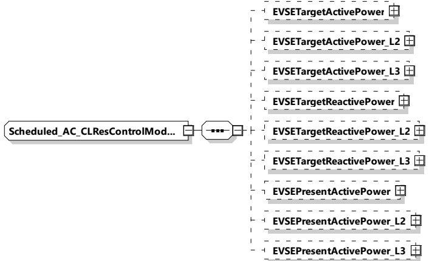

NOTE 2 Due to the uncertainties of measurement, see Annex O, and voltage drops on the cables, the EVCC can only understand how its charging behavior will impact the final bill of the customer, if the SECC provides the EVSEPresentActivePower, which is a key parameter for selecting the applied pricing rules.

###### 8.3.5.4.6 Scheduled AC CLRes ControlModeType

[V2G20-1756]

The SECC and the EVCC shall implement this type as defined in Table 164 and Figure 173.

Figure 173 — Schema diagram - Scheduled_AC_CLResControlModeType

The elements of this message are used according to Table 164.

Table 164 — Semantics and type definition for Scheduled_AC_CLResControlModeType

<table border=1 style='margin: auto; word-wrap: break-word;'><tr><td style='text-align: center; word-wrap: break-word;'>Element name</td><td style='text-align: center; word-wrap: break-word;'>Type</td><td style='text-align: center; word-wrap: break-word;'>Semantics</td></tr><tr><td style='text-align: center; word-wrap: break-word;'>EVSETargetActivePower</td><td style='text-align: center; word-wrap: break-word;'>complexType:RationalNumberTyperefer to 8.3.5.3.8</td><td style='text-align: center; word-wrap: break-word;'>Optional:Target active power requested by the EVSE</td></tr><tr><td style='text-align: center; word-wrap: break-word;'>EVSETargetActivePower_L2</td><td style='text-align: center; word-wrap: break-word;'>complexType:RationalNumberTyperefer to 8.3.5.3.8</td><td style='text-align: center; word-wrap: break-word;'>Optional:Target active power requested by the EVSE on phase L2 (as defined in 8.3.5.2.2)</td></tr><tr><td style='text-align: center; word-wrap: break-word;'>EVSETargetActivePower_L3</td><td style='text-align: center; word-wrap: break-word;'>complexType:RationalNumberTyperefer to 8.3.5.3.8</td><td style='text-align: center; word-wrap: break-word;'>Optional:Target active power requested by the EVSE on phase L3 (as defined in 8.3.5.2.2)</td></tr><tr><td style='text-align: center; word-wrap: break-word;'>EVSETargetReactivePower</td><td style='text-align: center; word-wrap: break-word;'>complexType:RationalNumberTyperefer to 8.3.5.3.8</td><td style='text-align: center; word-wrap: break-word;'>Optional:Target reactive power requested by the EVSE</td></tr><tr><td style='text-align: center; word-wrap: break-word;'>EVSETargetReactivePower_L2</td><td style='text-align: center; word-wrap: break-word;'>complexType:RationalNumberTyperefer to 8.3.5.3.8</td><td style='text-align: center; word-wrap: break-word;'>Optional:Target reactive power requested by the EVSE on phase L2 (as defined in 8.3.5.2.2)</td></tr></table>