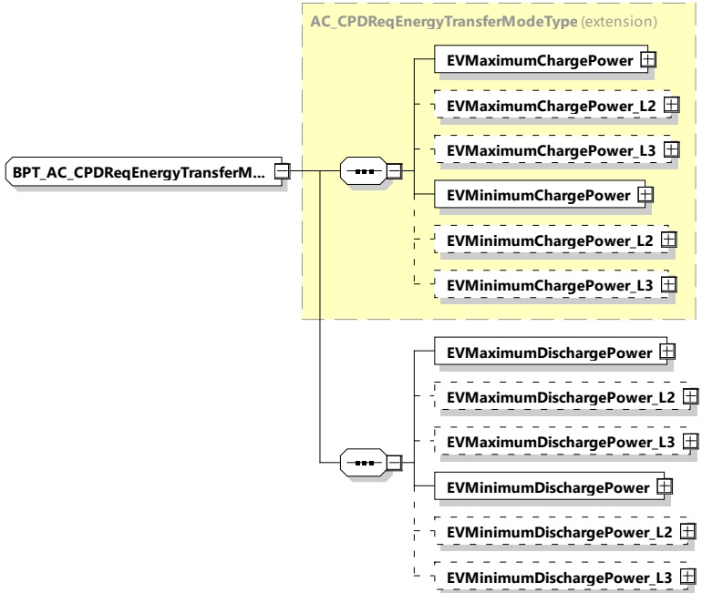

Figure 174 — Schema diagram - BPT_AC_CPDReqEnergyTransferModeType

The elements of this message are used according to Table 165.

Table 165 — Semantics and type definition for BPT_AC_CPDReqEnergyTransferModeType

<table border=1 style='margin: auto; word-wrap: break-word;'><tr><td style='text-align: center; word-wrap: break-word;'>Element name</td><td style='text-align: center; word-wrap: break-word;'>Type</td><td style='text-align: center; word-wrap: break-word;'>Semantics</td></tr><tr><td style='text-align: center; word-wrap: break-word;'>EVMaximumChargePower</td><td style='text-align: center; word-wrap: break-word;'>complexType:RationalNumberTyperefer to 8.3.5.3.8</td><td style='text-align: center; word-wrap: break-word;'>Maximum charge power supported by the EV</td></tr><tr><td style='text-align: center; word-wrap: break-word;'>EVMaximumChargePower_L2</td><td style='text-align: center; word-wrap: break-word;'>complexType:RationalNumberTyperefer to 8.3.5.3.8</td><td style='text-align: center; word-wrap: break-word;'>Optional:Maximum power supported by the EV on phase L2 (as defined in 8.3.5.2.2)</td></tr><tr><td style='text-align: center; word-wrap: break-word;'>EVMaximumChargePower_L3</td><td style='text-align: center; word-wrap: break-word;'>complexType:RationalNumberTyperefer to 8.3.5.3.8</td><td style='text-align: center; word-wrap: break-word;'>Optional:Maximum power supported by the EV on phase L3 (as defined in 8.3.5.2.2)</td></tr><tr><td style='text-align: center; word-wrap: break-word;'>EVMinimumChargePower</td><td style='text-align: center; word-wrap: break-word;'>complexType:RationalNumberTyperefer to 8.3.5.3.8</td><td style='text-align: center; word-wrap: break-word;'>Any target power between this level and zero may, for technical reasons, result in a drop of the actual power to zero watts.</td></tr></table>