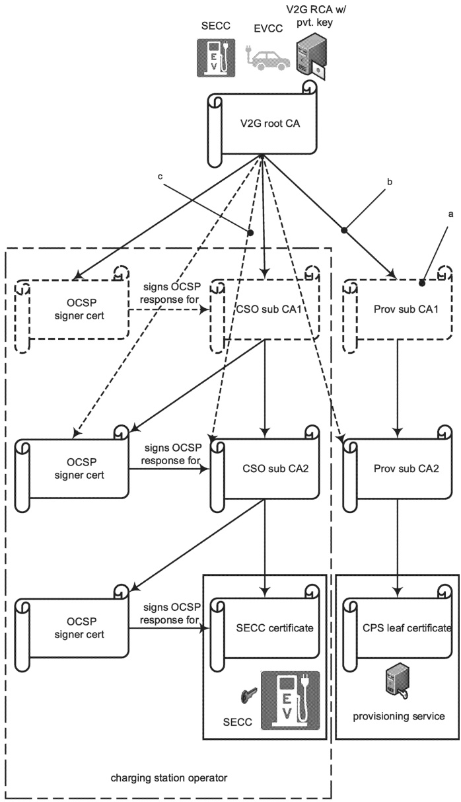

Key

a Optional certificate – If the sub-CA1 is not present, the sub-CA2 is signed by the V2G root CA.

b Direct certification – The use of sub-CA1 is optional.

Optional direct certification – If the sub-CA1 is present, it signs the sub-CA2 certificates.

Figure 5 — Mandatory certificate structure originating from V2G root CA certificate

© ISO 2022 – All rights reserved.

Copied with the permission of ANSI on behalf of ISO in connection with USDOT National Electric Vehicle Infrastructure (NEVI) Formula Program.

Copying not permitted. ©ISO. All rights reserved.