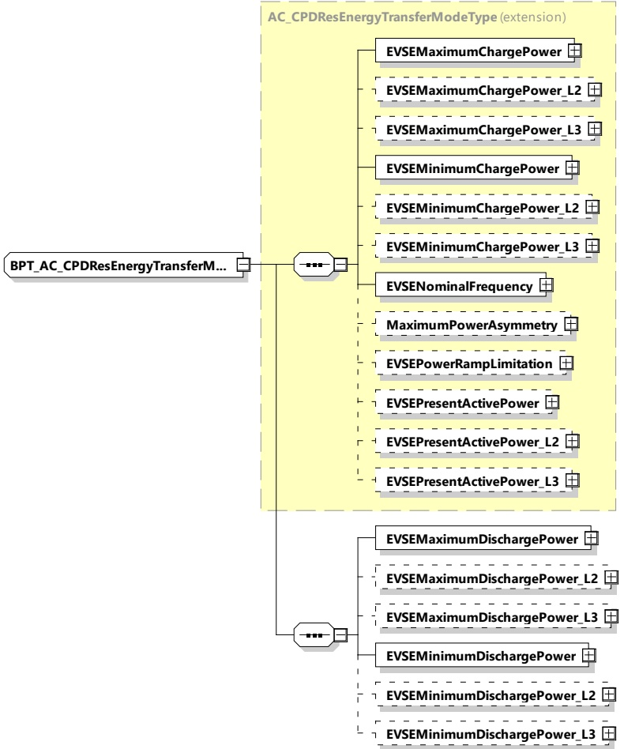

[V2G20-1457]

The EVCC and the SECC shall implement this type as defined in Figure 175 and Table 166.

Figure 175 — Schema diagram - BPT_AC_CPDResEnergyTransferModeType The elements of this message are used according to Table 166.

Table 166 — Semantics and type definition for BPT_AC_CPDResEnergyTransferModeType

<table border=1 style='margin: auto; word-wrap: break-word;'><tr><td style='text-align: center; word-wrap: break-word;'>Element name</td><td style='text-align: center; word-wrap: break-word;'>Type</td><td style='text-align: center; word-wrap: break-word;'>Semantics</td></tr><tr><td style='text-align: center; word-wrap: break-word;'>EVSEMaximumChargePower</td><td style='text-align: center; word-wrap: break-word;'>complexTypeRationalNumberTyperefer to 8.3.5.3.8</td><td style='text-align: center; word-wrap: break-word;'>Maximum power allowed by the EVSE</td></tr></table>