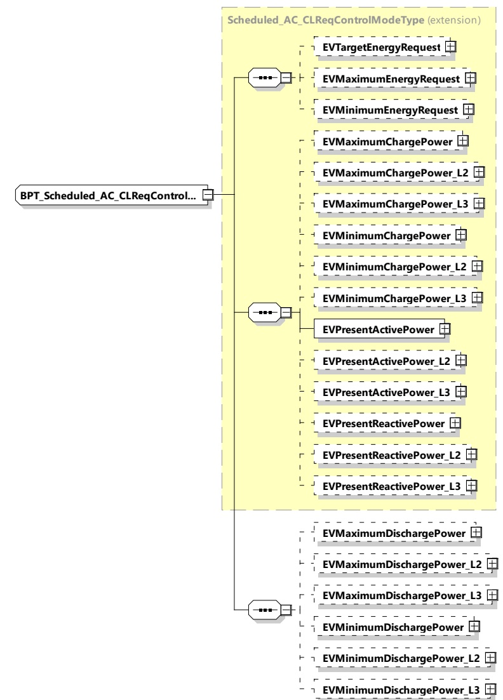

Figure 177 — Schema diagram - BPT_Scheduled_AC_CLReqControlModeType The elements of this message are used according to Table 168.

Table 168 — Semantics and type definition for BPT_Scheduled_AC_CLReqControlModeType

