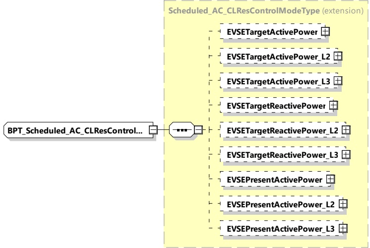

[V2G20-2661] The SECC shall only send MinimumSOC that is less than or equal to TargetSOC.

[V2G20-2667] If the EVCC selected the service parameter "MobilityNeedsMode" set to 2 and the SECC received new values for departure time, target SOC or minimum SOC from a secondary actor, the SECC shall include those updated values in DepartureTime, TargetSOC or MinimumSOC, respectively. If TargetSOC or MinimumSOC are included, then the SECC shall also include AckMaxDelay.

[V2G20-2668] If the EVCC selected the service parameter MobilityNeedsMode set to 2 and receives a AC_ChargeLoopRes message with DepartureTime, TargetSOC or MinimumSOC, and if the EVCC accepts this DepartureTime, TargetSOC or MinimumSOC, then the EVCC shall send updated values in a AC_ChargeLoopReq within the number of seconds stated in AckMaxDelay of AC_ChargeLoopRes.

[V2G20-2669] If the EVCC selected the service parameter MobilityNeedsMode set to 2 and EVCC receives a AC_ChargeLoopRes message with DepartureTime, TargetSOC or MinimumSOC, and if the EVCC cannot accept this DepartureTime, TargetSOC or MinimumSOC, e.g. for internal reasons, then the EVCC shall send different values in a AC_ChargeLoopReq than the values in AC_ChargeLoopRes within the number of seconds stated in AckMaxDelay of AC_ChargeLoopRes.

####### 8.3.5.4.7.6 BPT_Scheduled_AC_CLResControlModeType

This type contains all elements of the ACBidirectionalControlRes message that are only required in case the control mode Scheduled is chosen.

[V2G20-1767] The SECC and the EVCC shall implement this type as defined in Figure 179 and Table 170.

Figure 179 — Schema diagram - BPT_Scheduled_AC_CLResControlModeType

