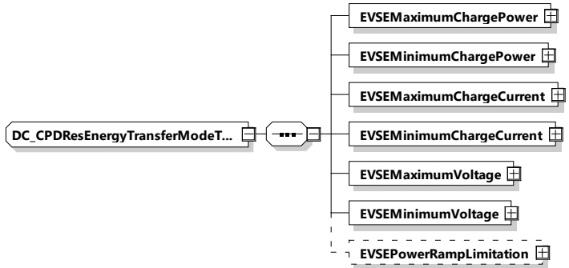

[V2G20-2181] During charging the SECC shall always respect the limits defined by EVMaximumChargePower, EVMaximumChargeCurrent, EVMaximumVoltage and EVMaximumVoltage.

NOTE 1 All limits are communicated in ChargeParameterDiscoveryReq initially and additionally can be updated in case of need in DC_ChargeLoopReq during the charging loop.

[V2G20-2182] During discharging the SECC shall always respect the limits defined by EVMaximumDischargePower, EVMaximumDischargeCurrent, EVMaximumVoltage and EVMaximumVoltage.

NOTE 2 All limits are communicated in ChargeParameterDiscoveryReq initially and additionally can be updated in case of need in DC_ChargeLoopReq during the charging loop.

###### 8.3.5.5.2 DC_CPDResEnergyTransferModeType

[V2G20-1349] The EVCC and the SECC shall implement this type as defined in Table 172 and Figure 181.

Figure 181 — Schema diagram - DC_CPDResEnergyTransferModeType

The elements of this message are used according to Table 172.

Table 172 — Semantics and type definition for DC_CPDResEnergyTransferModeType

<table border=1 style='margin: auto; word-wrap: break-word;'><tr><td style='text-align: center; word-wrap: break-word;'>Element name</td><td style='text-align: center; word-wrap: break-word;'>Type</td><td style='text-align: center; word-wrap: break-word;'>Semantics</td></tr><tr><td style='text-align: center; word-wrap: break-word;'>EVSEMaximumChargePower</td><td style='text-align: center; word-wrap: break-word;'>complexType:RationalNumberTyperefer to 8.3.5.3.8</td><td style='text-align: center; word-wrap: break-word;'>Maximum power the EVSE can deliver.</td></tr><tr><td style='text-align: center; word-wrap: break-word;'>EVSEMinimumChargePower</td><td style='text-align: center; word-wrap: break-word;'>complexType:RationalNumberTyperefer to 8.3.5.3.8</td><td style='text-align: center; word-wrap: break-word;'>Any target power between this level and zero may, for technical reasons, result in a drop of the actual power to zero watts.</td></tr><tr><td style='text-align: center; word-wrap: break-word;'>EVSEMaximumChargeCurrent</td><td style='text-align: center; word-wrap: break-word;'>complexType:RationalNumberTyperefer to 8.3.5.3.8</td><td style='text-align: center; word-wrap: break-word;'>Maximum current the EVSE can deliver.</td></tr><tr><td style='text-align: center; word-wrap: break-word;'>EVSEMinimumChargeCurrent</td><td style='text-align: center; word-wrap: break-word;'>complexType:RationalNumberTyperefer to 8.3.5.3.8</td><td style='text-align: center; word-wrap: break-word;'>Minimum current the EVSE can deliver with the expected accuracy.</td></tr></table>