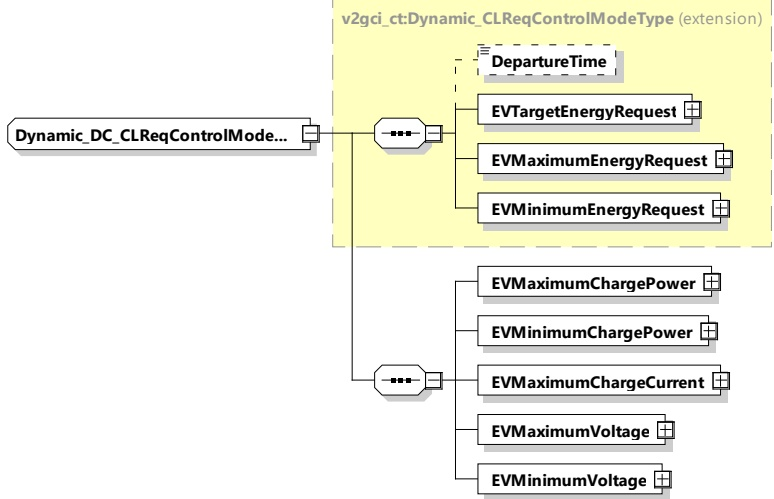

<table border=1 style='margin: auto; word-wrap: break-word;'><tr><td style='text-align: center; word-wrap: break-word;'>Element name</td><td style='text-align: center; word-wrap: break-word;'>Type</td><td style='text-align: center; word-wrap: break-word;'>Semantics</td></tr><tr><td style='text-align: center; word-wrap: break-word;'>EVSEMaximumVoltage</td><td style='text-align: center; word-wrap: break-word;'>complexType:RationalNumberTyperefer to 8.3.5.3.8</td><td style='text-align: center; word-wrap: break-word;'>Maximum voltage the EVSE can deliver.</td></tr><tr><td style='text-align: center; word-wrap: break-word;'>EVSEMinimumVoltage</td><td style='text-align: center; word-wrap: break-word;'>complexType:RationalNumberTyperefer to 8.3.5.3.8</td><td style='text-align: center; word-wrap: break-word;'>Minimum voltage the EVSE can deliver with the expected accuracy.</td></tr><tr><td style='text-align: center; word-wrap: break-word;'>EVSEPowerRampLimitation</td><td style='text-align: center; word-wrap: break-word;'>complexType:RationalNumberTyperefer to 8.3.5.3.8</td><td style='text-align: center; word-wrap: break-word;'>Optional:Limitation of the power variation in %/min.</td></tr></table>

8.3.5.5.3 Dynamic_DC_CLReqControlModeType

This type contains all elements of the DC_ChargeLoopReq message that are only required in case the control mode Dynamic is chosen.

[V2G20-1762]

The SECC and the EVCC shall implement this type as defined in Figure 182 and Table 173.

Figure 182 — Schema diagram - Dynamic_DC_CLReqControlModeType

The elements of this message are used according to Table 173.

Table 173 — Semantics and type definition for Dynamic_DC_CLReqControlModeType

