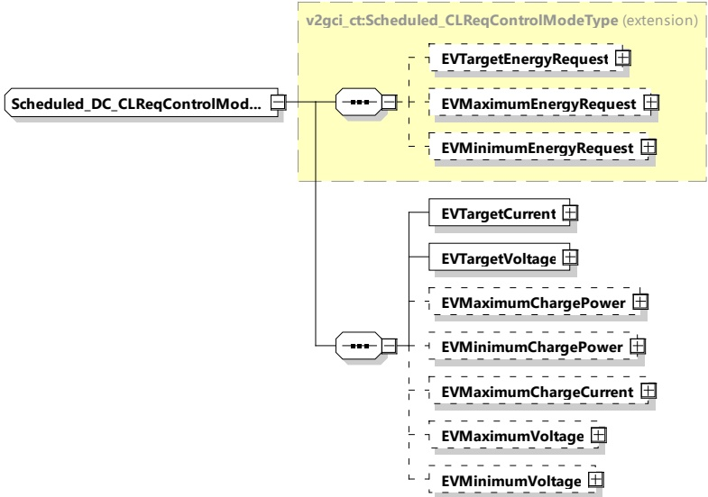

Figure 183 — Schema diagram - Scheduled_DC_CLReqControlModeType

The elements of this message are used according to Table 174.

Table 174 — Semantics and type definition for Scheduled_DC_CLReqControlModeType

<table border=1 style='margin: auto; word-wrap: break-word;'><tr><td style='text-align: center; word-wrap: break-word;'>Element name</td><td style='text-align: center; word-wrap: break-word;'>Type</td><td style='text-align: center; word-wrap: break-word;'>Semantics</td></tr><tr><td style='text-align: center; word-wrap: break-word;'>EVTargetEnergyRequest</td><td style='text-align: center; word-wrap: break-word;'>complexType:RationalNumberTyperefer to 8.3.5.3.8</td><td style='text-align: center; word-wrap: break-word;'>Optional:The energy request of the EV it needs to fulfil the target SOC as specified by the owner.</td></tr><tr><td style='text-align: center; word-wrap: break-word;'>EVMaximumEnergyRequest</td><td style='text-align: center; word-wrap: break-word;'>complexType:RationalNumberTyperefer to 8.3.5.3.8</td><td style='text-align: center; word-wrap: break-word;'>Optional:Maximum acceptable energy level of the EV.</td></tr><tr><td style='text-align: center; word-wrap: break-word;'>EVMinimumEnergyRequest</td><td style='text-align: center; word-wrap: break-word;'>complexType:RationalNumberTyperefer to 8.3.5.3.8</td><td style='text-align: center; word-wrap: break-word;'>Optional:The energy request of the EV it needs to fulfil the minimum SOC as specified by the owner.</td></tr><tr><td style='text-align: center; word-wrap: break-word;'>EVTargetCurrent</td><td style='text-align: center; word-wrap: break-word;'>complexType:RationalNumberTyperefer to 8.3.5.3.8</td><td style='text-align: center; word-wrap: break-word;'>Optional:Target current requested by the EV</td></tr><tr><td style='text-align: center; word-wrap: break-word;'>EVTargetVoltage</td><td style='text-align: center; word-wrap: break-word;'>complexType:RationalNumberTyperefer to 8.3.5.3.8</td><td style='text-align: center; word-wrap: break-word;'>Optional:Target voltage requested by the EV.</td></tr><tr><td style='text-align: center; word-wrap: break-word;'>EVMaximumChargePower</td><td style='text-align: center; word-wrap: break-word;'>complexType:RationalNumberTyperefer to 8.3.5.3.8</td><td style='text-align: center; word-wrap: break-word;'>Optional:Maximum charge power allowed by the EV.</td></tr></table>