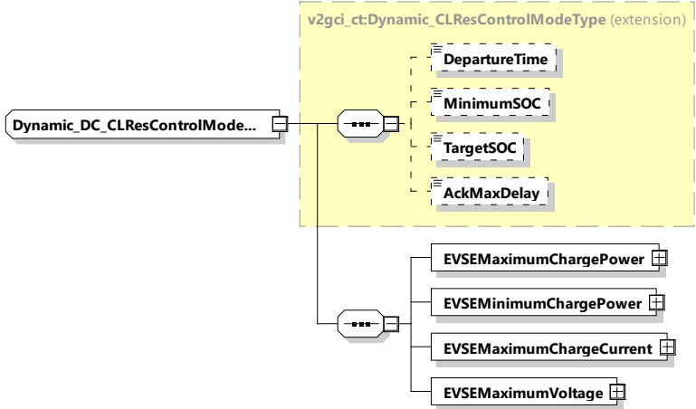

The SECC and the EVCC shall implement this type as defined in Table 175 and Figure 184.

Figure 184 — Schema diagram - Dynamic_DC_CLResControlModeType

The elements of this message are used according to Table 175.

Table 175 — Semantics and type definition for Dynamic_DC_CLResControlModeType

<table border=1 style='margin: auto; word-wrap: break-word;'><tr><td style='text-align: center; word-wrap: break-word;'>Element name</td><td style='text-align: center; word-wrap: break-word;'>Type</td><td style='text-align: center; word-wrap: break-word;'>Semantics</td></tr><tr><td style='text-align: center; word-wrap: break-word;'>DepartureTime</td><td style='text-align: center; word-wrap: break-word;'>simpleType: xs:unsignedInt</td><td style='text-align: center; word-wrap: break-word;'>Optional: This element is used to indicate when the user intends to finish the charging process. Only used when service parameter MobilityNeedsMode was set to 2 The value is encoded in seconds since the TimeStamp of the message header (see [V2G20-2104]).</td></tr><tr><td style='text-align: center; word-wrap: break-word;'>MinimumSOC</td><td style='text-align: center; word-wrap: break-word;'>simpleType: percentValueType refer to Annex A for the type definition</td><td style='text-align: center; word-wrap: break-word;'>Optional: New MinimumSOC value updated by the user from EVSE&#x27;s side Only used when service parameter MobilityNeedsMode was set to 2.</td></tr><tr><td style='text-align: center; word-wrap: break-word;'>TargetSOC</td><td style='text-align: center; word-wrap: break-word;'>simpleType: percentValueType refer to Annex A for the type definition</td><td style='text-align: center; word-wrap: break-word;'>Optional: New TargetSOC value updated by the user from EVSE&#x27;s side Only used when service parameter MobilityNeedsMode was set to 2.</td></tr></table>