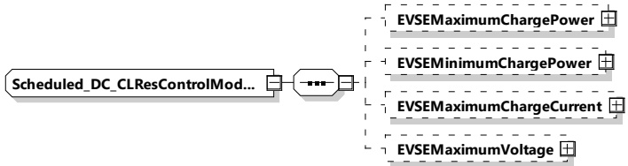

Figure 185 — Schema diagram - Scheduled_DC_CLResControlModeType

The elements of this message are used according to Table 176.

Table 176 — Semantics and type definition for Scheduled_DC_CLResControlModeType

<table border=1 style='margin: auto; word-wrap: break-word;'><tr><td style='text-align: center; word-wrap: break-word;'>Element name</td><td style='text-align: center; word-wrap: break-word;'>Type</td><td style='text-align: center; word-wrap: break-word;'>Semantics</td></tr><tr><td style='text-align: center; word-wrap: break-word;'>EVSEMaximumChargePower</td><td style='text-align: center; word-wrap: break-word;'>complexType:RationalNumberTyperefer to 8.3.5.3.8</td><td style='text-align: center; word-wrap: break-word;'>Optional:Maximum power the EVSE can deliver.</td></tr><tr><td style='text-align: center; word-wrap: break-word;'>EVSEMinimumChargePower</td><td style='text-align: center; word-wrap: break-word;'>complexType:RationalNumberTyperefer to 8.3.5.3.8</td><td style='text-align: center; word-wrap: break-word;'>Optional:Minimum power the EVSE can deliver.</td></tr><tr><td style='text-align: center; word-wrap: break-word;'>EVSEMaximumChargeCurrent</td><td style='text-align: center; word-wrap: break-word;'>complexType:RationalNumberTyperefer to 8.3.5.3.8</td><td style='text-align: center; word-wrap: break-word;'>Optional:Maximum current the EVSE can deliver.</td></tr><tr><td style='text-align: center; word-wrap: break-word;'>EVSEMaximumVoltage</td><td style='text-align: center; word-wrap: break-word;'>complexType:RationalNumberTyperefer to 8.3.5.3.8</td><td style='text-align: center; word-wrap: break-word;'>Optional:Maximum voltage the EVSE can deliver.</td></tr></table>

###### 8.3.5.5.7 DC BPT

####### 8.3.5.5.7.1 BPT_DC_CPDReqEnergyTransferModeType

[V2G20-1458] The EVCC and the SECC shall implement this type as defined in Table 177 and Figure 186.