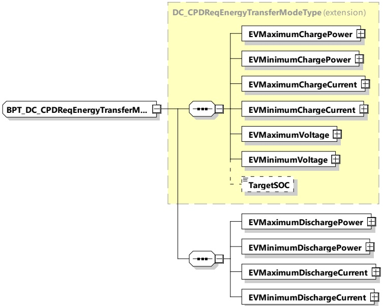

Figure 186 — Schema diagram - BPT_DC_CPDReqEnergyTransferModeType The elements of this message are used according to Table 177.

Table 177 — Semantics and type definition for BPT_DC_CPDReqEnergyTransferModeType

<table border=1 style='margin: auto; word-wrap: break-word;'><tr><td style='text-align: center; word-wrap: break-word;'>Element name</td><td style='text-align: center; word-wrap: break-word;'>Type</td><td style='text-align: center; word-wrap: break-word;'>Semantics</td></tr><tr><td style='text-align: center; word-wrap: break-word;'>EVMaximumChargePower</td><td style='text-align: center; word-wrap: break-word;'>complexType:RationalNumberTyperefer to 8.3.5.3.8</td><td style='text-align: center; word-wrap: break-word;'>Maximum charge power supported by the EV.</td></tr><tr><td style='text-align: center; word-wrap: break-word;'>EVMinimumChargePower</td><td style='text-align: center; word-wrap: break-word;'>complexType:RationalNumberTyperefer to 8.3.5.3.8</td><td style='text-align: center; word-wrap: break-word;'>Any target power between this level and zero may, for technical reasons, result in a drop of the actual power to zero watts.</td></tr><tr><td style='text-align: center; word-wrap: break-word;'>EVMaximumChargeCurrent</td><td style='text-align: center; word-wrap: break-word;'>complexType:RationalNumberTyperefer to 8.3.5.3.8</td><td style='text-align: center; word-wrap: break-word;'>Maximum charge current supported by the EV.</td></tr><tr><td style='text-align: center; word-wrap: break-word;'>EVMinimumChargeCurrent</td><td style='text-align: center; word-wrap: break-word;'>complexType:RationalNumberTyperefer to 8.3.5.3.8</td><td style='text-align: center; word-wrap: break-word;'>Any target current between this level and zero may, for technical reasons, result in a drop of the actual current to zero ampere.</td></tr><tr><td style='text-align: center; word-wrap: break-word;'>EVMaximumVoltage</td><td style='text-align: center; word-wrap: break-word;'>complexType:RationalNumberTyperefer to 8.3.5.3.8</td><td style='text-align: center; word-wrap: break-word;'>Maximum voltage supported by the EV.</td></tr><tr><td style='text-align: center; word-wrap: break-word;'>EVMinimumVoltage</td><td style='text-align: center; word-wrap: break-word;'>complexType:RationalNumberTyperefer to 8.3.5.3.8</td><td style='text-align: center; word-wrap: break-word;'>Minimum voltage supported by the EV.</td></tr></table>