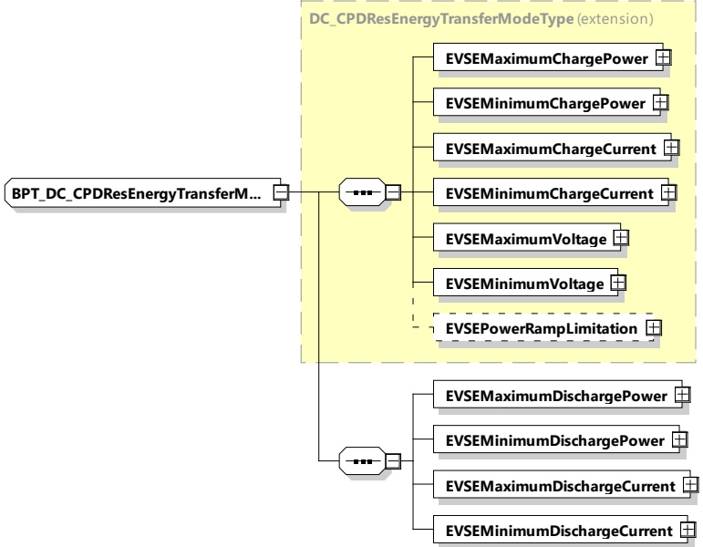

<table border=1 style='margin: auto; word-wrap: break-word;'><tr><td style='text-align: center; word-wrap: break-word;'>Element name</td><td style='text-align: center; word-wrap: break-word;'>Type</td><td style='text-align: center; word-wrap: break-word;'>Semantics</td></tr><tr><td style='text-align: center; word-wrap: break-word;'>TargetSOC</td><td style='text-align: center; word-wrap: break-word;'>simpleType:percentValueTyperefer to Annex A forthe type definition</td><td style='text-align: center; word-wrap: break-word;'>Optional:SOC at which the EV considers the battery tobe fully charged.</td></tr><tr><td style='text-align: center; word-wrap: break-word;'>EVMaximumDischargePower</td><td style='text-align: center; word-wrap: break-word;'>complexType:RationalNumberTyperefer to 8.3.5.3.8</td><td style='text-align: center; word-wrap: break-word;'>Maximum discharge power supported by theEV.</td></tr><tr><td style='text-align: center; word-wrap: break-word;'>EVMinimumDischargePower</td><td style='text-align: center; word-wrap: break-word;'>complexType:RationalNumberTyperefer to 8.3.5.3.8</td><td style='text-align: center; word-wrap: break-word;'>Any target power between this level andzero may, for technical reasons, result in adrop of the actual power to zero watts.</td></tr><tr><td style='text-align: center; word-wrap: break-word;'>EVMaximumDischargeCurrent</td><td style='text-align: center; word-wrap: break-word;'>complexType:RationalNumberTyperefer to 8.3.5.3.8</td><td style='text-align: center; word-wrap: break-word;'>Maximum discharge current supported bythe EV.</td></tr><tr><td style='text-align: center; word-wrap: break-word;'>EVMinimumDischargeCurrent</td><td style='text-align: center; word-wrap: break-word;'>complexType:RationalNumberTyperefer to 8.3.5.3.8</td><td style='text-align: center; word-wrap: break-word;'>Any target current between this level andzero may, for technical reasons, result in adrop of the actual current to zero ampere.</td></tr></table>

8.3.5.5.7.2 BPT_DC_CPDResEnergyTransferModeType

[V2G20-1459] The EVCC and the SECC shall implement this type as defined in Figure 187 and Table 178.

Figure 187 — Schema diagram - BPT_DC_CPDResEnergyTransferModeType

The elements of this message are used according to Table 178.

Copied with the permission of ANSI on behalf of ISO in connection with USDOT National Electric Vehicle Infrastructure (NEVI) Formula Program. Copying not permitted. ©ISO. All rights reserved.