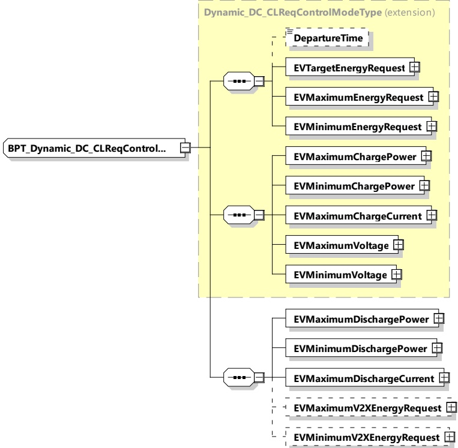

Figure 188 — Schema diagram - BPT_Dynamic_DC_CLReqControlModeType The elements of this message are used according to Table 179.

Table 179 — Semantics and type definition for BPT_Dynamic_DC_CLReqControlModeType

<table border=1 style='margin: auto; word-wrap: break-word;'><tr><td style='text-align: center; word-wrap: break-word;'>Element name</td><td style='text-align: center; word-wrap: break-word;'>Type</td><td style='text-align: center; word-wrap: break-word;'>Semantics</td></tr><tr><td style='text-align: center; word-wrap: break-word;'>DepartureTime</td><td style='text-align: center; word-wrap: break-word;'>simpleType:xs:unsignedInt</td><td style='text-align: center; word-wrap: break-word;'>Optional:This element is used to indicate when the EV intends to finish the charging process.The value is encoded in seconds since the TimeStamp of the message header (see [V2G20-2104]).</td></tr><tr><td style='text-align: center; word-wrap: break-word;'>EVTargetEnergyRequest</td><td style='text-align: center; word-wrap: break-word;'>complexType:RationalNumberTyperefer to 8.3.5.3.8</td><td style='text-align: center; word-wrap: break-word;'>The energy request of the EV it needs to fulfil the target SOC as specified by the owner.</td></tr><tr><td style='text-align: center; word-wrap: break-word;'>EVMaximumEnergyRequest</td><td style='text-align: center; word-wrap: break-word;'>complexType:RationalNumberTyperefer to 8.3.5.3.8</td><td style='text-align: center; word-wrap: break-word;'>Maximum acceptable energy level of the EV.</td></tr><tr><td style='text-align: center; word-wrap: break-word;'>EVMinimumEnergyRequest</td><td style='text-align: center; word-wrap: break-word;'>complexType:RationalNumberTyperefer to 8.3.5.3.8</td><td style='text-align: center; word-wrap: break-word;'>The energy request of the EV it needs to fulfil the minimum SOC as specified by the owner.</td></tr></table>