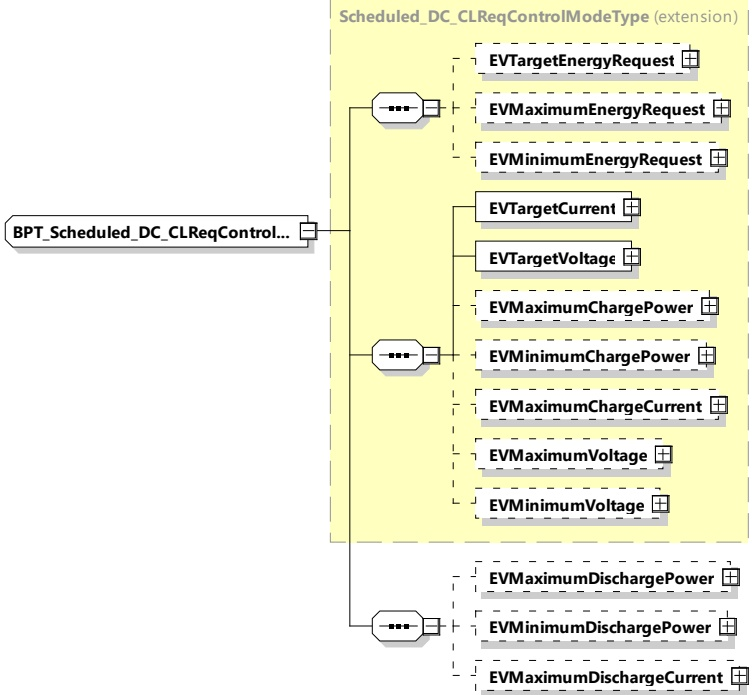

####### 8.3.5.5.7.4 BPT_Scheduled_DC_CLReqControlModeType

[V2G20-1770] The SECC and the EVCC shall implement this type as defined in Table 180 and Figure 189.

Figure 189 — Schema diagram - BPT_Scheduled_DC_CLReqControlModeType The elements of this message are used according to Table 180.

Table 180 — Semantics and type definition for BPT_Scheduled_DC_CLReqControlModeType

<table border=1 style='margin: auto; word-wrap: break-word;'><tr><td style='text-align: center; word-wrap: break-word;'>Element name</td><td style='text-align: center; word-wrap: break-word;'>Type</td><td style='text-align: center; word-wrap: break-word;'>Semantics</td></tr><tr><td style='text-align: center; word-wrap: break-word;'>EVTargetEnergyRequest</td><td style='text-align: center; word-wrap: break-word;'>complexType:RationalNumberTyperefer to 8.3.5.3.8</td><td style='text-align: center; word-wrap: break-word;'>Optional:The energy request of the EV it needs to fulfil the target SOC as specified by the owner.</td></tr><tr><td style='text-align: center; word-wrap: break-word;'>EVMaximumEnergyRequest</td><td style='text-align: center; word-wrap: break-word;'>complexType:RationalNumberTyperefer to 8.3.5.3.8</td><td style='text-align: center; word-wrap: break-word;'>Optional:Maximum acceptable energy level of the EV.</td></tr><tr><td style='text-align: center; word-wrap: break-word;'>EVMinimumEnergyRequest</td><td style='text-align: center; word-wrap: break-word;'>complexType:RationalNumberTyperefer to 8.3.5.3.8</td><td style='text-align: center; word-wrap: break-word;'>Optional:The energy request of the EV it needs to fulfil the minimum SOC as specified by the owner.</td></tr><tr><td style='text-align: center; word-wrap: break-word;'>EVTargetCurrent</td><td style='text-align: center; word-wrap: break-word;'>complexType:RationalNumberTyperefer to 8.3.5.3.8</td><td style='text-align: center; word-wrap: break-word;'>Target current requested by the EV</td></tr></table>

## 344 

Copied with the permission of ANSI on behalf of ISO in connection with USDOT National Electric Vehicle Infrastructure (NEVI) Formula Program. Copying not permitted. ©ISO. All rights reserved.