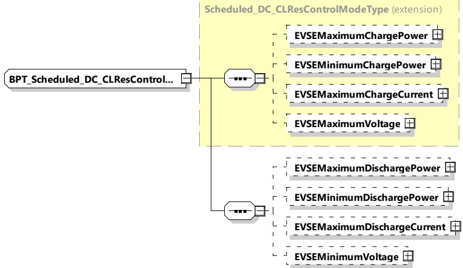

[V2G20-2672] If the EVCC selected the service parameter MobilityNeedsMode set to 2 and EVCC receives a DC_ChargeLoopRes message with DepartureTime, TargetSOC or MinimumSOC, and if the EVCC cannot accept this DepartureTime, TargetSOC or MinimumSOC, e.g. for internal reasons, then the EVCC shall send different values in a DC_ChargeLoopReq than the values in DC_ChargeLoopRes within the number of seconds stated in AckMaxDelay of the DC_ChargeLoopRes.

####### 8.3.5.5.7.6 BPT_Scheduled_DC_CLResControlModeType

[V2G20-1771] The SECC and the EVCC shall implement this type as defined in Table 182 and Figure 191.

Figure 191 — Schema diagram - BPT_Scheduled_DC_CLResControlModeType The elements of this message are used according to Table 182.

Table 182 — Semantics and type definition for BPT_Scheduled_DC_CLResControlModeType

<table border=1 style='margin: auto; word-wrap: break-word;'><tr><td style='text-align: center; word-wrap: break-word;'>Element name</td><td style='text-align: center; word-wrap: break-word;'>Type</td><td style='text-align: center; word-wrap: break-word;'>Semantics</td></tr><tr><td style='text-align: center; word-wrap: break-word;'>EVSEMaximumChargePower</td><td style='text-align: center; word-wrap: break-word;'>complexType:RationalNumberTyperefer to 8.3.5.3.8</td><td style='text-align: center; word-wrap: break-word;'>Optional:Maximum power the EVSE can deliver.</td></tr><tr><td style='text-align: center; word-wrap: break-word;'>EVSEMinimumChargePower</td><td style='text-align: center; word-wrap: break-word;'>complexType:RationalNumberTyperefer to 8.3.5.3.8</td><td style='text-align: center; word-wrap: break-word;'>Optional:Any target power between this level and zero may, for technical reasons, result in a drop of the actual power to zero watts.</td></tr><tr><td style='text-align: center; word-wrap: break-word;'>EVSEMaximumChargeCurrent</td><td style='text-align: center; word-wrap: break-word;'>complexType:RationalNumberTyperefer to 8.3.5.3.8</td><td style='text-align: center; word-wrap: break-word;'>Optional:Maximum current the EVSE can deliver.</td></tr><tr><td style='text-align: center; word-wrap: break-word;'>EVSEMaximumVoltage</td><td style='text-align: center; word-wrap: break-word;'>complexType:RationalNumberTyperefer to 8.3.5.3.8</td><td style='text-align: center; word-wrap: break-word;'>Optional:Maximum voltage the EVSE can deliver.</td></tr></table>