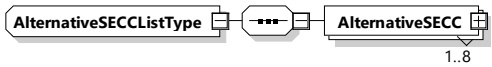
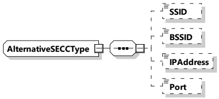

<table border=1 style='margin: auto; word-wrap: break-word;'><tr><td style='text-align: center; word-wrap: break-word;'>Element name</td><td style='text-align: center; word-wrap: break-word;'>Type</td><td style='text-align: center; word-wrap: break-word;'>Semantics</td></tr><tr><td style='text-align: center; word-wrap: break-word;'>EVSEMaximumDischargePower</td><td style='text-align: center; word-wrap: break-word;'>complexType:RationalNumberTyperefer to 8.3.5.3.8</td><td style='text-align: center; word-wrap: break-word;'>Optional:Maximum discharge power the EVSE can deliver.</td></tr><tr><td style='text-align: center; word-wrap: break-word;'>EVSEMinimumDischargePower</td><td style='text-align: center; word-wrap: break-word;'>complexType:RationalNumberTyperefer to 8.3.5.3.8</td><td style='text-align: center; word-wrap: break-word;'>Optional:Any target power between this level and zero may, for technical reasons, result in a drop of the actual power to zero watts.</td></tr><tr><td style='text-align: center; word-wrap: break-word;'>EVSEMaximumDischargeCurrent</td><td style='text-align: center; word-wrap: break-word;'>complexType:RationalNumberTyperefer to 8.3.5.3.8</td><td style='text-align: center; word-wrap: break-word;'>Optional:Maximum discharge current the EVSE can deliver.</td></tr><tr><td style='text-align: center; word-wrap: break-word;'>EVSEMinimumVoltage</td><td style='text-align: center; word-wrap: break-word;'>complexType:RationalNumberTyperefer to 8.3.5.3.8</td><td style='text-align: center; word-wrap: break-word;'>Optional:Minimum voltage the EVSE can deliver.</td></tr></table>

##### 8.3.5.6 WPT

###### 8.3.5.6.1 AlternativeSECCListType

[V2G20-5102] The EVCC and the SECC shall implement this type as defined in Figure 192 and Table 183.

Figure 192 — Schema diagram - AlternativeSECCListType

The elements of this message are used according to Table 183.

Table 183 — Semantics and type definition for AlternativeSECListType

<table border=1 style='margin: auto; word-wrap: break-word;'><tr><td style='text-align: center; word-wrap: break-word;'>Element name</td><td style='text-align: center; word-wrap: break-word;'>Type</td><td style='text-align: center; word-wrap: break-word;'>Semantics</td></tr><tr><td style='text-align: center; word-wrap: break-word;'>AlternativeSECC</td><td style='text-align: center; word-wrap: break-word;'>complexType:AlternativeSECCTyperefer to 8.3.5.6.2</td><td style='text-align: center; word-wrap: break-word;'>Contains a list of SECC connection information.AlternativeSECCList includes at least oneAlternativeSECC and may include up to 8AlternativeSECCs.</td></tr></table>

###### 8.3.5.6.2 Alternative SECCType

[V2G20-5103] The EVCC and the SECC shall implement this type as defined in Figure 193 and Table 184.

