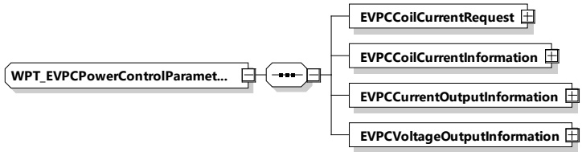

## Figure 193 — Schema diagram - Alternative SECCType

The elements of this message are used according to Table 184.

Table 184 — Semantics and type definition for AlternativeSECCType

<table border=1 style='margin: auto; word-wrap: break-word;'><tr><td style='text-align: center; word-wrap: break-word;'>Element name</td><td style='text-align: center; word-wrap: break-word;'>Type</td><td style='text-align: center; word-wrap: break-word;'>Semantics</td></tr><tr><td style='text-align: center; word-wrap: break-word;'>SSID</td><td style='text-align: center; word-wrap: break-word;'>simpleType: identifierType refer to Annex A for the type definition</td><td style='text-align: center; word-wrap: break-word;'>Optional: SSID (Service Set ID) of the WLAN of the SECC</td></tr><tr><td style='text-align: center; word-wrap: break-word;'>BSSID</td><td style='text-align: center; word-wrap: break-word;'>simpleType: bSSIDType refer to Annex A for the type definition</td><td style='text-align: center; word-wrap: break-word;'>Optional: BSSID (Basic Service Set ID) of the WLAN of the SECC (MAC address of the AP)</td></tr><tr><td style='text-align: center; word-wrap: break-word;'>IPAddress</td><td style='text-align: center; word-wrap: break-word;'>simpleType: ipaddressType refer to Annex A for the type definition</td><td style='text-align: center; word-wrap: break-word;'>Optional: IP address of the SECC</td></tr><tr><td style='text-align: center; word-wrap: break-word;'>Port</td><td style='text-align: center; word-wrap: break-word;'>simpleType: xs:unsignedShort</td><td style='text-align: center; word-wrap: break-word;'>Optional: TCP port number of the SECC</td></tr></table>

###### 8.3.5.6.3 Data types related to power transfer

The following complex data types are used in messages which are controlling power transfer.

####### 8.3.5.6.3.1 WPT EVPC Power Control Parameter Type

[V2G20-5104] The EVCC and the SECC shall implement this type as defined in Figure 194 and Table 185.

Figure 194 — Schema diagram - WPT_EVPCPowerControlParameterType

The elements of this message are used according to Table 185.