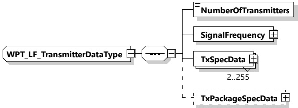

Figure 196 — Schema diagram - WPT_LF_SystemSetupDataType

The elements of this message are used according to Table 187.

Table 187 — Semantics and type definition for WPT_LF_SystemSetupDataType

<table border=1 style='margin: auto; word-wrap: break-word;'><tr><td style='text-align: center; word-wrap: break-word;'>Element name</td><td style='text-align: center; word-wrap: break-word;'>Type</td><td style='text-align: center; word-wrap: break-word;'>Semantics</td></tr><tr><td style='text-align: center; word-wrap: break-word;'>LF_TransmitterSetupData</td><td style='text-align: center; word-wrap: break-word;'>complexType:WPT_LF_TransmitterDataTyperefer to 8.3.5.6.4.2</td><td style='text-align: center; word-wrap: break-word;'>Setup data for the set of LF transmitters installed</td></tr><tr><td style='text-align: center; word-wrap: break-word;'>LF_ReceiverSetupData</td><td style='text-align: center; word-wrap: break-word;'>complexType:WPT_LF_ReceiverDataTyperefer to 8.3.5.6.4.3</td><td style='text-align: center; word-wrap: break-word;'>Setup data for the set of receivers installed</td></tr></table>

[V2G20-5107] Either TransmitterSetupData or ReceiverSetupData can be given. See 8.3.5.6.4.2 and 8.3.5.6.4.3 for more information.

8.3.5.6.4.2 WPT\_LF\_TransmitterDataType

[V2G20-5108] The EVCC and the SECC shall implement this type as defined in Figure 197 and Table 188.

Figure 197 — Schema diagram - WPT_LF_TransmitterDataType

The elements of this message are used according to Table 188.

Table 188 — Semantics and type definition for WPT_LF_TransmitterDataType

<table border=1 style='margin: auto; word-wrap: break-word;'><tr><td style='text-align: center; word-wrap: break-word;'>Element name</td><td style='text-align: center; word-wrap: break-word;'>Type</td><td style='text-align: center; word-wrap: break-word;'>Semantics</td></tr><tr><td style='text-align: center; word-wrap: break-word;'>NumberOfTransmitters</td><td style='text-align: center; word-wrap: break-word;'>simpleType:xs:unsignedByte</td><td style='text-align: center; word-wrap: break-word;'>Number of transmitters of the auxiliary antenna system installed</td></tr><tr><td style='text-align: center; word-wrap: break-word;'>SignalFrequency</td><td style='text-align: center; word-wrap: break-word;'>complexTypeRationalNumberTyperefer to 8.3.5.3.8</td><td style='text-align: center; word-wrap: break-word;'>Frequency in Hz of the signal to be used</td></tr><tr><td style='text-align: center; word-wrap: break-word;'>TxSpecData</td><td style='text-align: center; word-wrap: break-word;'>complexType:WPT_TxRxSpecDataTyperefer to 8.3.5.6.4.4</td><td style='text-align: center; word-wrap: break-word;'>For each transmitter this element is given with information about position and orientation of the transmitter.</td></tr></table>

Copied with the permission of ANSI on behalf of ISO in connection with USDOT National Electric Vehicle Infrastructure (NEVI) Formula Program. Copying not permitted. ©ISO. All rights reserved.