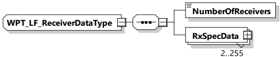

<table border=1 style='margin: auto; word-wrap: break-word;'><tr><td style='text-align: center; word-wrap: break-word;'>Element name</td><td style='text-align: center; word-wrap: break-word;'>Type</td><td style='text-align: center; word-wrap: break-word;'>Semantics</td></tr><tr><td style='text-align: center; word-wrap: break-word;'>TxPackageSpecData</td><td style='text-align: center; word-wrap: break-word;'>complexType:WPT_TxRxPackageSpecDataTyperefer to 8.3.5.6.4.6</td><td style='text-align: center; word-wrap: break-word;'>Optional:Information about the order how signals are emitted from the individual transmitters</td></tr></table>

####### 8.3.5.6.4.3 WPT\_LF\_ReceiverDataType

[V2G20-5109] The EVCC and the SECC shall implement this type as defined in Figure 198 and Table 189.

Figure 198 — Schema diagram - WPT_LF_ReceiverDataType

The elements of this message are used according to Table 189.

Table 189 — Semantics and type definition for WPT_LF_ReceiverDataType

<table border=1 style='margin: auto; word-wrap: break-word;'><tr><td style='text-align: center; word-wrap: break-word;'>Element name</td><td style='text-align: center; word-wrap: break-word;'>Type</td><td style='text-align: center; word-wrap: break-word;'>Semantics</td></tr><tr><td style='text-align: center; word-wrap: break-word;'>NumberOfReceivers</td><td style='text-align: center; word-wrap: break-word;'>simpleType:xs:unsignedByte</td><td style='text-align: center; word-wrap: break-word;'>Number of receivers of the auxiliary antenna system installed</td></tr><tr><td style='text-align: center; word-wrap: break-word;'>RxSpecData</td><td style='text-align: center; word-wrap: break-word;'>complexType:WPT_TxRxSpecDataTyperefer to 8.3.5.6.4.4</td><td style='text-align: center; word-wrap: break-word;'>For each receiver this element is given with information about position and orientation of the receiver.</td></tr></table>

8.3.5.6.4.4 WPT_TxRxSpecDataType

[V2G20-5110] The EVCC and the SECC shall implement this type as defined in Figure 199 and Table 190.

Figure 199 — Schema diagram - WPT_TxRxSpecDataType

The elements of this message are used according to Table 190.