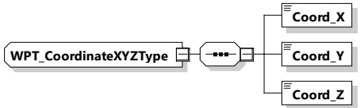

Table 190 — Semantics and type definition for WPT_TxRxSpecDataType

<table border=1 style='margin: auto; word-wrap: break-word;'><tr><td style='text-align: center; word-wrap: break-word;'>Element name</td><td style='text-align: center; word-wrap: break-word;'>Type</td><td style='text-align: center; word-wrap: break-word;'>Semantics</td></tr><tr><td style='text-align: center; word-wrap: break-word;'>TxRxIdentifier</td><td style='text-align: center; word-wrap: break-word;'>simpleType:numericIDTyperefer to Annex A for the type definition</td><td style='text-align: center; word-wrap: break-word;'>Identifier of the transmitter/receiver</td></tr><tr><td style='text-align: center; word-wrap: break-word;'>TxRxPosition</td><td style='text-align: center; word-wrap: break-word;'>complexType:WPT_CoordinateXYZTyperefer to 8.3.5.6.4.5</td><td style='text-align: center; word-wrap: break-word;'>x,y,z coordinates of the transmitter/receiver given in EV coordinates relative to the center of the secondary device or rather the primary device given in mm</td></tr><tr><td style='text-align: center; word-wrap: break-word;'>TxRxOrientation</td><td style='text-align: center; word-wrap: break-word;'>complexType:WPT_CoordinateXYZTyperefer to 8.3.5.6.4.5</td><td style='text-align: center; word-wrap: break-word;'>x,y,z,unit vector given the direction of measurement. If no direction is applicable, all three values are set to zero.</td></tr></table>

8.3.5.6.4.5 WPT_CoordinateXYZType

[V2G20-5111] The EVCC and the SECC shall implement this type as defined in Figure 200 and Table 191.

Figure 200 — Schema diagram - WPT_CoordinateXYZType

The elements of this message are used according to Table 191.

Table 191 — Semantics and type definition for WPT_CoordinateXYZType

<table border=1 style='margin: auto; word-wrap: break-word;'><tr><td style='text-align: center; word-wrap: break-word;'>Element name</td><td style='text-align: center; word-wrap: break-word;'>Type</td><td style='text-align: center; word-wrap: break-word;'>Semantics</td></tr><tr><td style='text-align: center; word-wrap: break-word;'>Coord_X</td><td style='text-align: center; word-wrap: break-word;'>simpleType:xs:short</td><td style='text-align: center; word-wrap: break-word;'>X value in the related coordinate system</td></tr><tr><td style='text-align: center; word-wrap: break-word;'>Coord_Y</td><td style='text-align: center; word-wrap: break-word;'>simpleType:xs:short</td><td style='text-align: center; word-wrap: break-word;'>Y value in the related coordinate system</td></tr><tr><td style='text-align: center; word-wrap: break-word;'>Coord_Z</td><td style='text-align: center; word-wrap: break-word;'>simpleType:xs:short</td><td style='text-align: center; word-wrap: break-word;'>Z value in the related coordinate system</td></tr></table>

####### 8.3.5.6.4.6 WPT_TxRxPackageSpecDataType

[V2G20-5112] The EVCC and the SECC shall implement this type as defined in Figure 201 and Table 192.