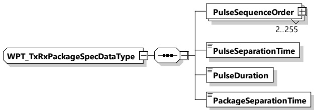

Figure 201 — Schema diagram - WPT_TxRxPackageSpecDataType

The elements of this message are used according to Table 192.

Table 192 — Semantics and type definition for WPT_TxRxPackageSpecDataType

<table border=1 style='margin: auto; word-wrap: break-word;'><tr><td style='text-align: center; word-wrap: break-word;'>Element name</td><td style='text-align: center; word-wrap: break-word;'>Type</td><td style='text-align: center; word-wrap: break-word;'>Semantics</td></tr><tr><td style='text-align: center; word-wrap: break-word;'>PulseSequenceOrder</td><td style='text-align: center; word-wrap: break-word;'>complexType:WPT_TxRxPulseOrderTypeSee 8.3.5.6.4.7</td><td style='text-align: center; word-wrap: break-word;'>Ordered list of the antenna identifiers, which describes the order with which the transmitters send out a signal as one pulse package.The list defines a pulse package, which contains the ordered collection of pulses from each EV transmitter.For each transmitter this element shall be given once.</td></tr><tr><td style='text-align: center; word-wrap: break-word;'>PulseSeparationTime</td><td style='text-align: center; word-wrap: break-word;'>simpleType:xs:unsignedShort</td><td style='text-align: center; word-wrap: break-word;'>Time in ms between the individual pulses within the pulse package</td></tr><tr><td style='text-align: center; word-wrap: break-word;'>PulseDuration</td><td style='text-align: center; word-wrap: break-word;'>simpleType:xs:unsignedShort</td><td style='text-align: center; word-wrap: break-word;'>Time duration in ms of each individual pulse within the pulse package</td></tr><tr><td style='text-align: center; word-wrap: break-word;'>PackageSeparationTime</td><td style='text-align: center; word-wrap: break-word;'>simpleType:xs:unsignedShort</td><td style='text-align: center; word-wrap: break-word;'>Time in ms between two subsequent pulse packages</td></tr></table>

8.3.5.6.4.7 WPT_TxRxPulseOrderType

[V2G20-5113] The EVCC and the SECC shall implement this type as defined in Figure 202 and Table 193.

Figure 202 — Schema diagram - WPT_TxRxPulseOrderType

The elements of this message are used according to Table 193.

Table 193 — Semantics and type definition for WPT_TxRxPulseOrderType

<table border=1 style='margin: auto; word-wrap: break-word;'><tr><td style='text-align: center; word-wrap: break-word;'>Element name</td><td style='text-align: center; word-wrap: break-word;'>Type</td><td style='text-align: center; word-wrap: break-word;'>Semantics</td></tr><tr><td style='text-align: center; word-wrap: break-word;'>IndexNumber</td><td style='text-align: center; word-wrap: break-word;'>simpleType:xs:unsignedShort</td><td style='text-align: center; word-wrap: break-word;'>Position in the ordered list</td></tr></table>