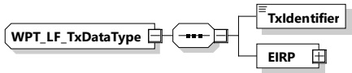

<table border=1 style='margin: auto; word-wrap: break-word;'><tr><td style='text-align: center; word-wrap: break-word;'>Element name</td><td style='text-align: center; word-wrap: break-word;'>Type</td><td style='text-align: center; word-wrap: break-word;'>Semantics</td></tr><tr><td rowspan="3">TxIdentifier</td><td style='text-align: center; word-wrap: break-word;'>simpleType:</td><td rowspan="3">Identifier of the transmitter at this position in the ordered list</td></tr><tr><td style='text-align: center; word-wrap: break-word;'>numericIDType</td></tr><tr><td style='text-align: center; word-wrap: break-word;'>refer to Annex A for the type definition</td></tr></table>

8.3.5.6.4.8 WPT_LF_TxDataListType

[V2G20-5115] The EVCC and the SECC shall implement this type as defined in Figure 203 and Table 194.

Figure 203 — Schema diagram - WPT_LF_TxDataListType

The elements of this message are used according to Table 194.

Table 194 — Semantics and type definition for WPT_LF_TxDataListType

<table border=1 style='margin: auto; word-wrap: break-word;'><tr><td style='text-align: center; word-wrap: break-word;'>Element name</td><td style='text-align: center; word-wrap: break-word;'>Type</td><td style='text-align: center; word-wrap: break-word;'>Semantics</td></tr><tr><td style='text-align: center; word-wrap: break-word;'>WPT_LF_TxDataList</td><td style='text-align: center; word-wrap: break-word;'>complexType:WPT_LF_TxDataTyperefer to 8.3.5.6.4.9</td><td style='text-align: center; word-wrap: break-word;'>List of WPT_LF_TxData.This list is carrying the data for each transmitter of a set of transmitters installed</td></tr></table>

8.3.5.6.4.9 WPT\_LF\_TxDataType

[V2G20-5114] The EVCC and the SECC shall implement this type as defined in Figure 204 and Table 195.

Figure 204 — Schema diagram - WPT_LF_TxDataType

The elements of this message are used according to Table 195.

Table 195 — Semantics and type definition for WPT_LF_TxDataType

<table border=1 style='margin: auto; word-wrap: break-word;'><tr><td style='text-align: center; word-wrap: break-word;'>Element name</td><td style='text-align: center; word-wrap: break-word;'>Type</td><td style='text-align: center; word-wrap: break-word;'>Semantics</td></tr><tr><td style='text-align: center; word-wrap: break-word;'>TxIdentifier</td><td style='text-align: center; word-wrap: break-word;'>simpleType:numericIDTyperefer to Annex A for the type definition</td><td style='text-align: center; word-wrap: break-word;'>Identifier of transmitter</td></tr><tr><td style='text-align: center; word-wrap: break-word;'>EIRP</td><td style='text-align: center; word-wrap: break-word;'>complexType:RationalNumberTyperefer to 8.3.5.3.8</td><td style='text-align: center; word-wrap: break-word;'>EIRP value (signal strength of the emitted signal); is used by the transmitting component</td></tr></table>

8.3.5.6.4.10 WPT_LF_RxDataType

