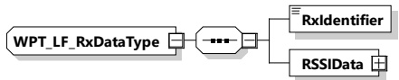

[V2G20-5117] The EVCC and the SECC shall implement this type as defined in Figure 205 and Table 196.

Figure 205 — Schema diagram - WPT_LF_RxDataType

The elements of this message are used according to Table 196.

Table 196 — Semantics and type definition for WPT_LF_RxDataListType

<table border=1 style='margin: auto; word-wrap: break-word;'><tr><td style='text-align: center; word-wrap: break-word;'>Element name</td><td style='text-align: center; word-wrap: break-word;'>Type</td><td style='text-align: center; word-wrap: break-word;'>Semantics</td></tr><tr><td style='text-align: center; word-wrap: break-word;'>WPT_LF_RxDataList</td><td style='text-align: center; word-wrap: break-word;'>complexType:WPT_LF_RxDataTypeSee 8.3.5.6.4.11</td><td style='text-align: center; word-wrap: break-word;'>Element which contains the information about the received LF signals for a set of receivers.</td></tr></table>

####### 8.3.5.6.4.11 WPT_LF_RxDataType

[V2G20-5116] The EVCC and the SECC shall implement this type as defined in Figure 206 and Table 197.

Figure 206 — Schema diagram - WPT_LF_RxDataType

The elements of this message are used according to Table 197.

Table 197 — Semantics and type definition for WPT_LF_RxDataType

<table border=1 style='margin: auto; word-wrap: break-word;'><tr><td style='text-align: center; word-wrap: break-word;'>Element name</td><td style='text-align: center; word-wrap: break-word;'>Type</td><td style='text-align: center; word-wrap: break-word;'>Semantics</td></tr><tr><td style='text-align: center; word-wrap: break-word;'>RxIdentifier</td><td style='text-align: center; word-wrap: break-word;'>simpleType:numericIDTyperefer to Annex A for the type definition</td><td style='text-align: center; word-wrap: break-word;'>Identifier of the receiver</td></tr><tr><td style='text-align: center; word-wrap: break-word;'>RSSIData</td><td style='text-align: center; word-wrap: break-word;'>complexType:WPT_LF_RxRSSIListTyperefer to 8.3.5.6.4.12</td><td style='text-align: center; word-wrap: break-word;'>List which contains the RSSI values for the individual signals (pulses) received from the different transmitters</td></tr></table>

####### 8.3.5.6.4.12 WPT\_LF\_RxRSSIListType

[V2G20-5119] The EVCC and the SECC shall implement this type as defined in Figure 207 and Table 198.

Figure 207 — Schema diagram - WPT_LF_RxRSSIListType

The elements of this message are used according to Table 198.