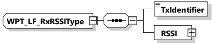
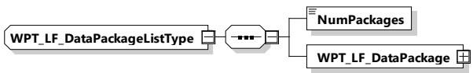

Table 198 — Semantics and type definition for WPT_LF_RxRSSIListType

<table border=1 style='margin: auto; word-wrap: break-word;'><tr><td style='text-align: center; word-wrap: break-word;'>Element name</td><td style='text-align: center; word-wrap: break-word;'>Type</td><td style='text-align: center; word-wrap: break-word;'>Semantics</td></tr><tr><td style='text-align: center; word-wrap: break-word;'>RSSIDataList</td><td style='text-align: center; word-wrap: break-word;'>complexType:WPT_LF_RxRSSITypeSee 8.3.5.6.4.13</td><td style='text-align: center; word-wrap: break-word;'>List of received RSSI signalsThe order of the RSSI values listed here should correspond to the PulseOrder which was given during fine positioning setup</td></tr></table>

8.3.5.6.4.13 WPT\_LF\_RxRSSIType

[V2G20-5118] The EVCC and the SECC shall implement this type as defined in Figure 208 and Table 199.

Figure 208 — Schema diagram - WPT_LF_RxRSSIType

The elements of this message are used according to Table 199.

Table 199 — Semantics and type definition for WPT_LF_RxRSSIType

<table border=1 style='margin: auto; word-wrap: break-word;'><tr><td style='text-align: center; word-wrap: break-word;'>Element name</td><td style='text-align: center; word-wrap: break-word;'>Type</td><td style='text-align: center; word-wrap: break-word;'>Semantics</td></tr><tr><td style='text-align: center; word-wrap: break-word;'>TxIdentifier</td><td style='text-align: center; word-wrap: break-word;'>simpleType:numericIDTyperefer to Annex A for the type definition</td><td style='text-align: center; word-wrap: break-word;'>Identifier of the transmitter which is assigned to the LF signal (pulse) received</td></tr><tr><td style='text-align: center; word-wrap: break-word;'>RSSI</td><td style='text-align: center; word-wrap: break-word;'>complexType:RationalNumberTyperefer to 8.3.5.3.8</td><td style='text-align: center; word-wrap: break-word;'>(Pre-processed) RSSI value of the received LF signal (pulse)</td></tr></table>

####### 8.3.5.6.4.14 WPT_LF_DataPackageListType

[V2G20-5121] The EVCC and the SECC shall implement this type as defined in Figure 209 and Table 200.

Figure 209 — Schema diagram - WPT_LF_DataPackageListType

The elements of this message are used according to Table 200.