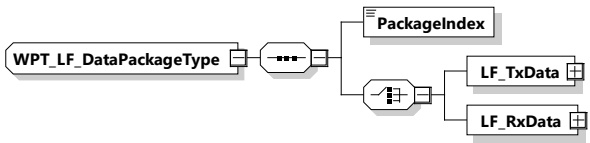

Table 200 — Semantics and type definition for WPT_LF_DataPackageListType

<table border=1 style='margin: auto; word-wrap: break-word;'><tr><td style='text-align: center; word-wrap: break-word;'>Element name</td><td style='text-align: center; word-wrap: break-word;'>Type</td><td style='text-align: center; word-wrap: break-word;'>Semantics</td></tr><tr><td style='text-align: center; word-wrap: break-word;'>NumPackages</td><td style='text-align: center; word-wrap: break-word;'>simpleType:xs:unsignedByte</td><td style='text-align: center; word-wrap: break-word;'>Number of data packages</td></tr><tr><td style='text-align: center; word-wrap: break-word;'>WPT_LF_DataPackage</td><td style='text-align: center; word-wrap: break-word;'>complexType:WPT_LF_DataPackageTypeRefer to 8.3.5.6.4.15</td><td style='text-align: center; word-wrap: break-word;'>Data packages</td></tr></table>

8.3.5.6.4.15 WPT_LF_DataPackageType

[V2G20-5120] The EVCC and the SECC shall implement this type as defined in Figure 210 and Table 201.

Figure 210 — Schema diagram - WPT_LF_DataPackageType

The elements of this message are used according to Table 201.

Table 201 — Semantics and type definition for WPT_LF_DataPackageType

<table border=1 style='margin: auto; word-wrap: break-word;'><tr><td style='text-align: center; word-wrap: break-word;'>Element name</td><td style='text-align: center; word-wrap: break-word;'>Type</td><td style='text-align: center; word-wrap: break-word;'>Semantics</td></tr><tr><td style='text-align: center; word-wrap: break-word;'>PackageIndex</td><td style='text-align: center; word-wrap: break-word;'>simpleType:xs:unsignedByte</td><td style='text-align: center; word-wrap: break-word;'>Index number of the signal package (consecutive numbered for each positioning process)</td></tr><tr><td style='text-align: center; word-wrap: break-word;'>LF_TxData</td><td style='text-align: center; word-wrap: break-word;'>complexType:WPT_LF_TxDataListTypeSee 8.3.5.6.4.8</td><td style='text-align: center; word-wrap: break-word;'>Data package(s) containing information of transmitted data</td></tr><tr><td style='text-align: center; word-wrap: break-word;'>LF_RxData</td><td style='text-align: center; word-wrap: break-word;'>complexType:WPT_LF_RxDataListTypeSee 8.3.5.6.4.10</td><td style='text-align: center; word-wrap: break-word;'>Data package(s) containing information of received data</td></tr></table>

8.3.5.7 ACDP

###### 8.3.5.7.1 EVTechnicalStatusType

[V2G20-4011] The EVCC and the SECC shall implement the message elements as defined in Figure 211 and Table 202.