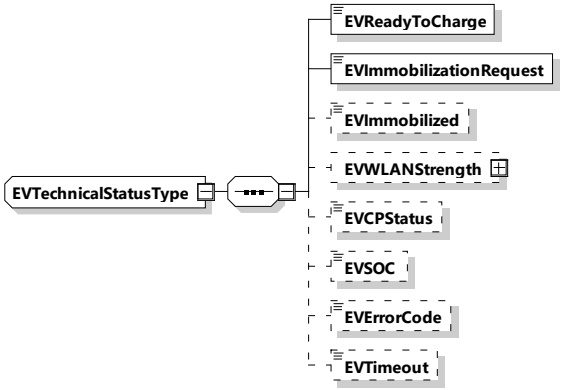

Figure 211 – Schema diagram – EVTechnicalStatusType

The elements of this message are used according to Table 202.

Table 202 — Semantics and type definition for EVTechnicalStatusType

<table border=1 style='margin: auto; word-wrap: break-word;'><tr><td style='text-align: center; word-wrap: break-word;'>Element name</td><td style='text-align: center; word-wrap: break-word;'>Type</td><td style='text-align: center; word-wrap: break-word;'>Semantics</td></tr><tr><td style='text-align: center; word-wrap: break-word;'>EVReadyToCharge</td><td style='text-align: center; word-wrap: break-word;'>simpleType: xs:boolean</td><td style='text-align: center; word-wrap: break-word;'>Element signalizes if the EV is READY or NOT READY to charge. This status shall consider all sub-systems and conditions in the EV that are relevant for the charging process. Possible states are: True, False</td></tr><tr><td style='text-align: center; word-wrap: break-word;'>EVImmobilizationRequest</td><td style='text-align: center; word-wrap: break-word;'>simpleType: xs:boolean</td><td style='text-align: center; word-wrap: break-word;'>Represents the request of immobilization of the EV. This may be related to the hand brake status. Possible states are: True, False</td></tr><tr><td style='text-align: center; word-wrap: break-word;'>EVImmobilized</td><td style='text-align: center; word-wrap: break-word;'>simpleType: xs:boolean</td><td style='text-align: center; word-wrap: break-word;'>Optional: The immobilization of the EV is a mandatory precondition to activate the pantograph. Possible states are: True, False</td></tr><tr><td style='text-align: center; word-wrap: break-word;'>EVWLANStrength</td><td style='text-align: center; word-wrap: break-word;'>complexType: RationalNumberType refer to 8.3.5.3.8</td><td style='text-align: center; word-wrap: break-word;'>Optional: Element signalizes EV WiFi reception signal strength (-dBm)</td></tr><tr><td style='text-align: center; word-wrap: break-word;'>EVCPStatus</td><td style='text-align: center; word-wrap: break-word;'>simpleType: cpStatusType refer to Annex A for the type definition</td><td style='text-align: center; word-wrap: break-word;'>Optional: Element is used to indicate the CP status as recognized by the EVCC (A, B, C, D, E). This may differ in error cases from the CP state recognition of the SECC. Refer to IEC 61851-23-1.</td></tr></table>