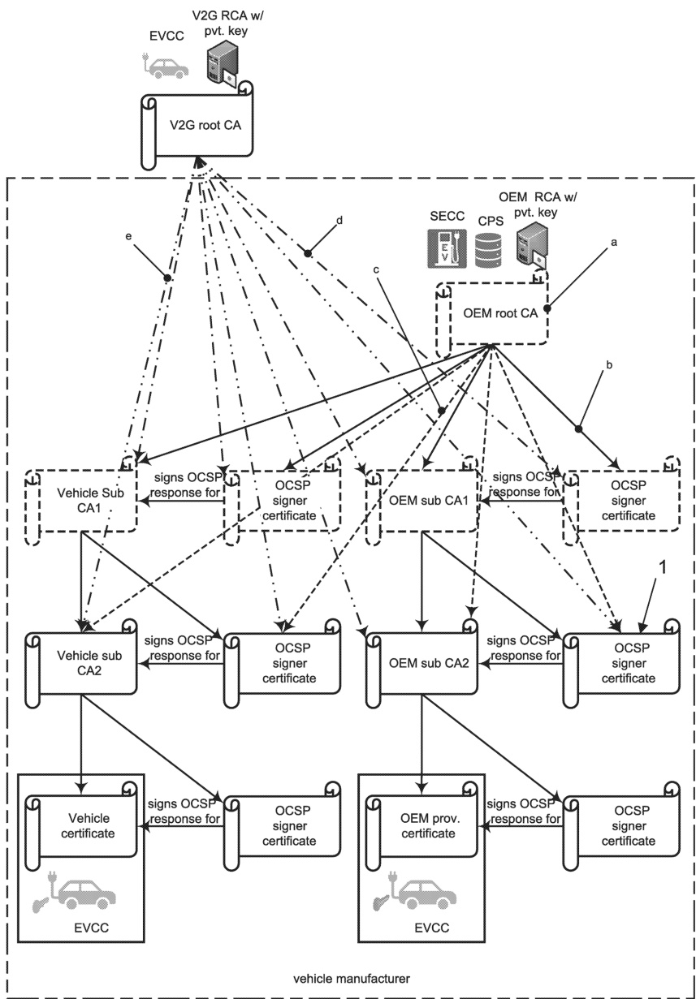

## Key

1 certificate

a Optional certificate — If the sub-CA1 is not present, the sub-CA2 is signed by the V2G root CA.

b Direct certification — The use of sub-CA1 is optional.

Optional direct certification — If the sub-CA1 is present, it signs the sub-CA2 certificates.

## 32 

Copied with the permission of ANSI on behalf of ISO in connection with USDOT National Electric Vehicle Infrastructure (NEVI) Formula Program. Copying not permitted. ©ISO. All rights reserved.